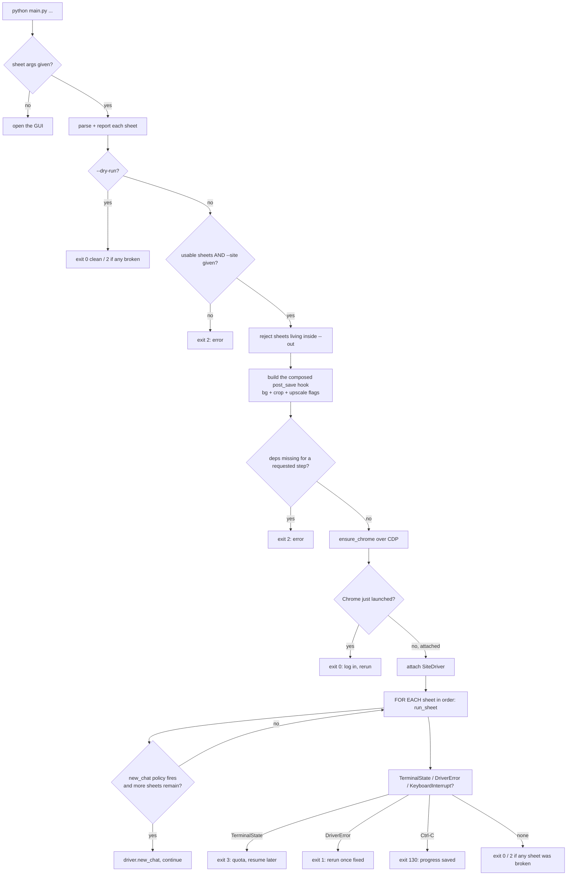

# Main (Entry Point) — Flow

**About:** [description](../__about/main.md)

## Algorithm

Pseudocode (language-neutral):

    parse CLI args
    IF no sheet arguments:
        open GUI, return 0

    FOR EACH sheet argument:
        TRY parse_sheet(path)
        EXCEPT unreadable/contract error: report, mark broken, skip
        ELSE: print report; IF sheet has problems: mark broken, skip
              ELSE: keep it

    IF --dry-run: return (2 if any broken else 0)
    IF no usable sheets OR no --site: print error, return 2
    IF any sheet's source path resolves inside --out: print error, return 2

    build post_save hook FROM (--no-bgfix, --no-crop, --upscale)
    IF the hook reports a missing dependency: print error, return 2

    resolve pause timing FROM --pause (fixed or random range)
    resolve prompt suffix FROM (--site, --background)

    ensure a debuggable Chrome is running (launch with the project
        profile if none answers)
    IF Chrome was just launched: print "log in, rerun", return 0

    attach SiteDriver over CDP
    total = 0
    FOR EACH sheet, in the given order:
        generated = run_sheet(sheet, driver, ...)
        total += generated
        IF new_chat policy says so AND more sheets remain:
            driver.new_chat()   # failure here is logged, never fatal
    print totals
    return (2 if any sheet was broken else 0)

    ON TerminalState (quota): return 3
    ON DriverError: return 1
    ON KeyboardInterrupt: return 130
    FINALLY: driver.close()
