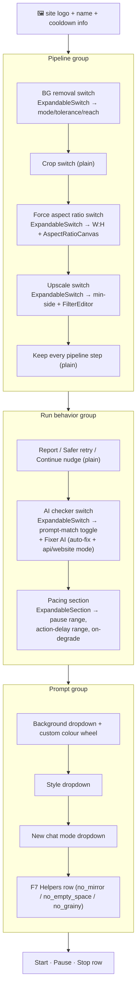

# Agent Panel — Flow

**About:** [description](../__about/agent_panel.md)

## Layout



**`_stack_groups`** grids the three groups as one vertical stack — the
panel's width is its LEFT-column parent's, never the window's.

**Restore-time hush (`apply_settings`):** a Tk write-trace cannot tell
a restore `.set()` from a click, so the whole round-trip runs under
`quiet_restore(*self._expanders())` — otherwise every ON switch would
auto-expand its sub-panel on every app open instead of staying compact.

Pseudocode for the per-switch expander contract (`ExpandableSwitch`,
shared by BG removal / Force aspect ratio / Upscale / AI checker):

```
ON switch flips true (a real click, not a restore):
    build the sub-panel body once (build_sub), if not built yet
    auto-expand it (reveal the body, rotate the caret open)
switch flips false:
    fold the body away (hide it, rotate the caret closed)
    the sub-panel's OWN state (FilterEditor rows, canvas ratio) is
        NOT torn down — it is just hidden, so re-enabling shows the
        same fine-tune again
caret click (independent of the switch's own on/off):
    toggle body visibility only — does not touch the switch itself
```
