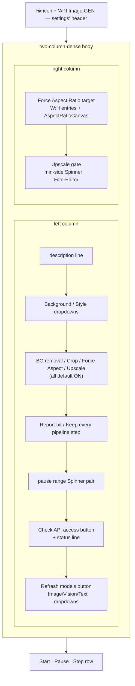

# API Panel — Flow

**About:** [description](../__about/api_panel.md)

## Layout



**"Check API access" probe** (`_probe_access`): a background thread
makes one cheap `ai.generate_image` call → posts `("ok"|"gated"|
"error", text)` onto `_probe_q` → `_poll_probe` (armed via
`self.after(AI_POLL_MS, ...)`) drains it on the main thread →
`_apply_probe_result` flips `access_gated` and re-styles Start.
`_refresh_models` follows the identical shape over its own
`_models_q`/poll pair, ending in `_populate_model_dropdowns` instead
of a gate flag.

Pseudocode for the gate that actually blocks a run:

```
on Start clicked:
    IF panel.access_gated:
        refuse — show AI_IMAGE_GATE_MESSAGE, spawn nothing
    ELSE:
        spawn _drive_site worker with a fresh ApiImageAdapter()
        # a REAL PaidFeatureRequired hit mid-run still maps to
        # TerminalState inside extract_image — the probe is a
        # convenience, never the only guard
```
