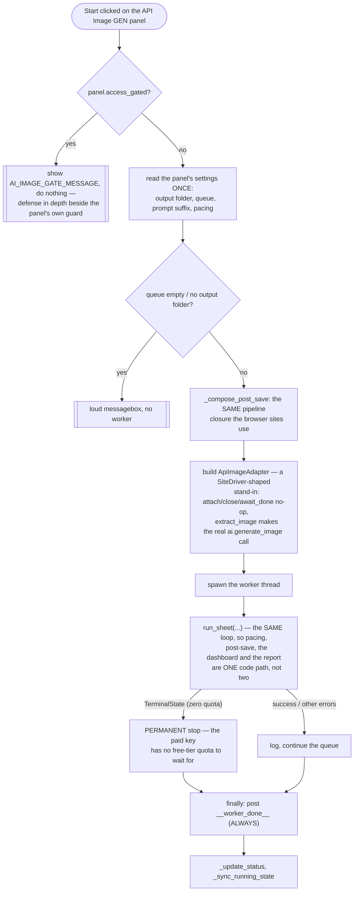

# API Image Job — Flow

**About:** [description](../__about/app_api_image_job.md)

## Algorithm — `_start_api_image` (the paid-API job's whole start)

Every message this worker posts — progress, status, the finish tag —
lands in the ONE queue drained by [Queue Pump](app_dispatch.md); the
worker never touches a widget itself.

The adapter's own contract (what `submit_prompt` / `submit_with_image` /
`extract_image` do, and how a free-tier-exhausted 429 becomes
`driver.TerminalState`) lives with the adapter, in
[API Panel](../__about/api_panel.md).
