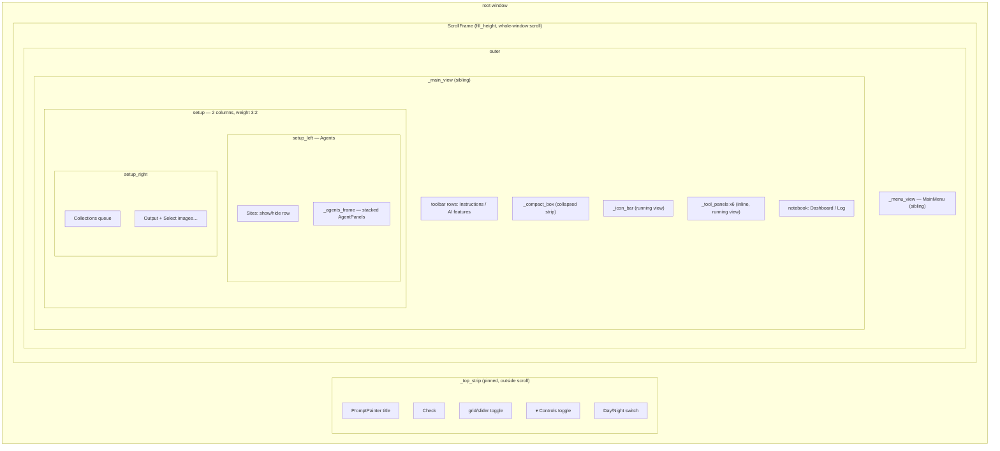

# Build Mixin — Flow

**About:** [description](../__about/app_build.md)

## Layout



## Construction order (pseudocode)

```
BuildMixin.__init__(root):
    apply saved theme BEFORE any widget exists (no first-frame flash)
    seed empty state: workers, stop/pause events, job_temps, cooldowns
    build pinned top strip (shell) OUTSIDE the scroll area
    build ScrollFrame(fill_height=True) wrapping everything else
    build _menu_view (MainMenu) and _main_view as SIBLINGS of "outer"
    inside _main_view:
        build _controls_box (LEFT settings column + RIGHT input column)
        build _compact_box (collapsed strip, unpacked)
        build notebook (Dashboard / Log), unpacked until a job runs
        build _icon_bar (unpacked)
        build all 6 _tool_panels (unpacked)
    wire zoom + wheel routing bindings
    _set_collapsed(False); _set_view("menu")   # deterministic initial packing
    _apply_settings(saved settings)            # may restore geometry/state
    arm _on_root_configure watcher LAST         # after geometry is applied
```

## The drag-resize / maximize watcher (`_on_root_configure`)

```mermaid
flowchart TB
    A["root <Configure> event"] --> B{event.widget is root?}
    B -- no --> Z["ignore (child configure)"]
    B -- yes --> C{state changed?<br/>(normal <-> zoomed)}
    C -- yes --> D["update _win_state/_win_size<br/>NO cover (owner 2026-07-21 revert)"]
    C -- no --> E{size changed?}
    E -- no --> Y["pure move — nothing to do"]
    E -- yes --> F["mark _resize_active = True<br/>re-arm settle timer"]
    F --> G["_drain_queue buffers __event__<br/>messages into _pending_events"]
    G --> H{RESIZE_SETTLE_MS elapsed<br/>since last Configure?}
    H -- yes --> I["_resize_settled: flush all<br/>buffered events, in order"]
```

The maximize/restore branch (`D`) is bookkeeping only — no
`smooth_transition` cover — because a real-window repro proved the
cover breaks the OS's own transition (window stuck at old size, or a
corrupted restore frame). See [Build Mixin](../__about/app_build.md)'s
Design Decisions.
