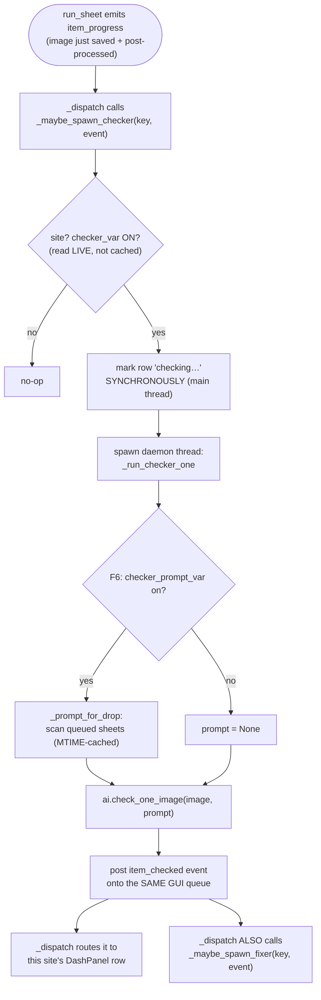

# Checker/Fixer Mixin — Flow

**About:** [description](../__about/app_checker_fixer.md)

## Algorithm — parallel per-item Checker AI



This overlaps BOTH the remaining "our time" pause and the entire next
item's generation — the earliest possible moment the checker could
start, since `item_progress` fires only after the final post-processed
bytes are already on disk.

## Pseudocode — `_fixer_decision` → auto-dispatch

```
FUNCTION maybe_spawn_fixer(key, item_checked_event):
    agent = self.agents.get(key)
    decision = fixer_decision(agent, event)   # reads fixer_var/fixer_mode_var LIVE
    IF decision == "none": RETURN            # switch off, or image wasn't flagged
    IF decision == "api":
        spawn thread: _run_fixer_api          # a plain REST call — genuinely
                                               # overlaps the site's next generation
    IF decision == "website_queue":
        _queue_website_fix                    # NEVER touches the browser —
                                               # folds into AiCheckPanel's queue,
                                               # owner clicks "Send flagged" later
```

## Pseudocode — manual fix buttons (`_build_fix_workers`)

```
FUNCTION build_fix_workers(rel, out_base, defects, raw, jobtemp_slot=None):
    IF jobtemp_slot is None:
        jobtemp_slot = reverse-lookup site from rel (ai.drop_and_site_for)
    image_worker = partial(_run_image_fix, ...)       # ALWAYS offered
    website_worker = None
    IF a real SITES entry resolves for this image:
        website_worker = partial(_run_website_fix, ...)  # None for API-Image-GEN
                                                          # output (no browser tab)
    RETURN (image_worker, website_worker)
```

Both workers back the pre-fix file up (`step="fixer"`, best-effort —
loud skip if no live `JobTemp` for that slot) before overwriting, so
the fix is restorable in the Steps… filmstrip exactly like a pipeline
stage.
