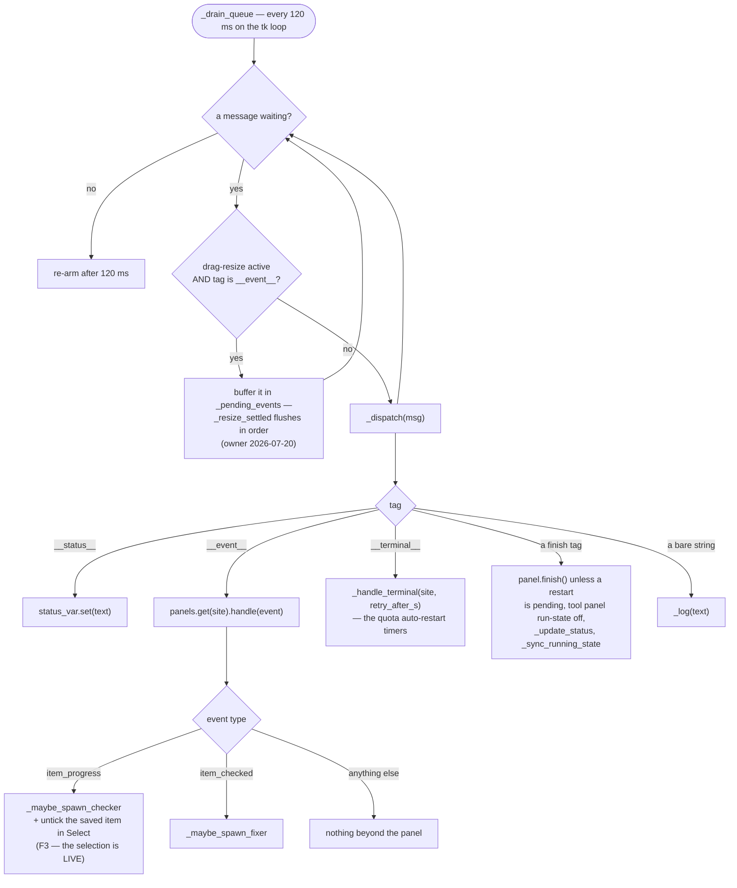

# Queue Pump — Flow

**About:** [description](../__about/app_dispatch.md)

## Algorithm — one queue, one dispatch table

`panels.get(...)` — never `panels[...]` — is the deliberate guard for a
late event arriving after its panel was closed.

The two AI hooks hang off `__event__` rather than off the runner, which
is exactly what kept `painter/runner.py` unchanged when each landed: the
parallel Checker AI rides the SAME `item_progress` event the dashboard
row was just built from, and the Fixer AI rides the checker's own
`item_checked` result, posted back onto this same queue.

Pseudocode (language-neutral):

    FUNCTION drain_queue():
        WHILE the queue is not empty:
            msg = queue.get_nowait()
            IF resize_active AND msg is an __event__ tuple:
                pending_events.append(msg)      # flushed by _resize_settled
                CONTINUE
            dispatch(msg)
        after(120 ms, drain_queue)               # re-arm

    FUNCTION dispatch(msg):
        IF msg is not a tuple: log(str(msg)); RETURN
        SWITCH msg[0]:
            "__status__":   status_var.set(msg[1])
            "__event__":    panel = panels.get(msg[1])
                            IF panel: panel.handle(msg[2])
                                      IF type == item_progress:
                                          maybe_spawn_checker(...)
                                          untick the saved item in Select
                                      ELIF type == item_checked:
                                          maybe_spawn_fixer(...)
            "__terminal__": handle_terminal(msg[1], msg[2])
            a finish tag:   finish the panel unless a restart is pending,
                            then update_status + sync_running_state
