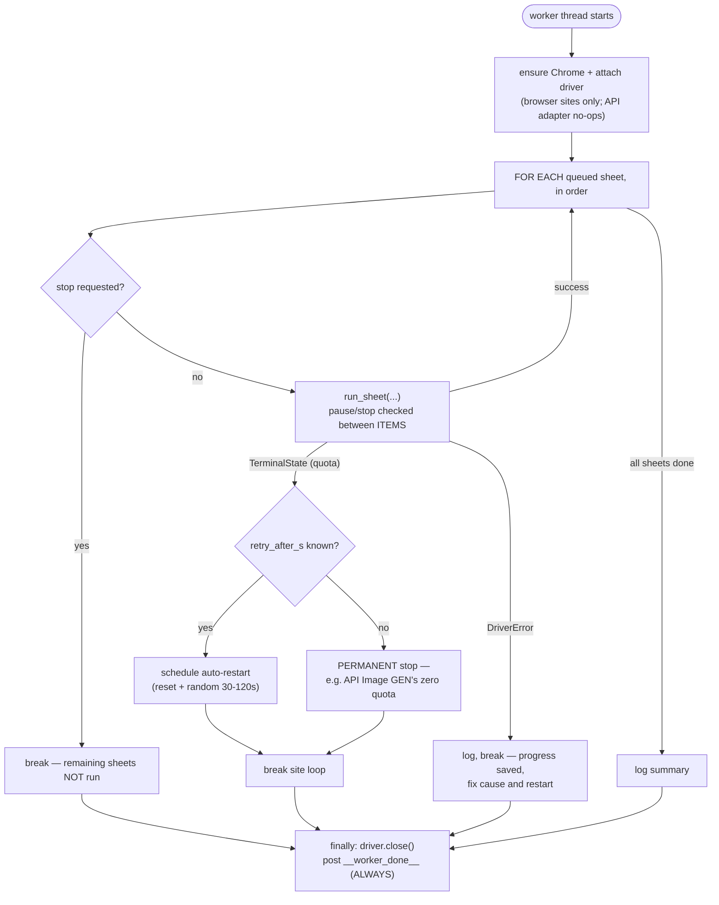
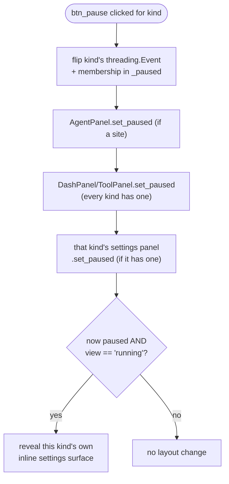

# Site Jobs Mixin — Flow

**About:** [description](../__about/app_jobs.md)

## Algorithm — `_drive_site` (one worker thread's whole run)



## Pseudocode — `_compose_post_save` (the pipeline composer)

```
FUNCTION compose_post_save(key, panel=None):
    panel = panel OR self.agents[key]
    read panel's do_bg / do_crop / do_aspect / do_upscale switches ONCE
    IF none are on: RETURN None
    IF postprocess deps missing: RETURN the problem string
    read upscale params/conditions, force-aspect W:H, bg fine-tune ONCE

    RETURN post_save(path):
        steps = []
        IF do_bg: append ("REMOVE BG", remove_background)
        IF do_crop: append ("CROP", crop_transparent)
        IF do_aspect: append ("ASPECT", change_aspect)
        IF do_upscale: append ("UPSCALE", gate_and_upscale)
        RETURN run_pipeline_steps(path, steps, temp, keep_all_steps, on_cap)
```

Steps ALWAYS run in this fixed order — BG → Crop → Aspect(force) →
Upscale — regardless of which subset is ticked; with Force Aspect off
(the default) this is byte-identical to the pre-pipeline behavior.

## Algorithm — `_toggle_pause_job` (one handler, every `JOB_ORDER` kind)



The actual wait is a shared, public function
(`painter.runner.wait_while_paused`) polled between items by three
independent call sites: `_drive_site` (via `run_sheet`), `_run_tool_job`,
and `_run_ai_check_job` — a Stop always wins over a pending Pause at
every one of them.
