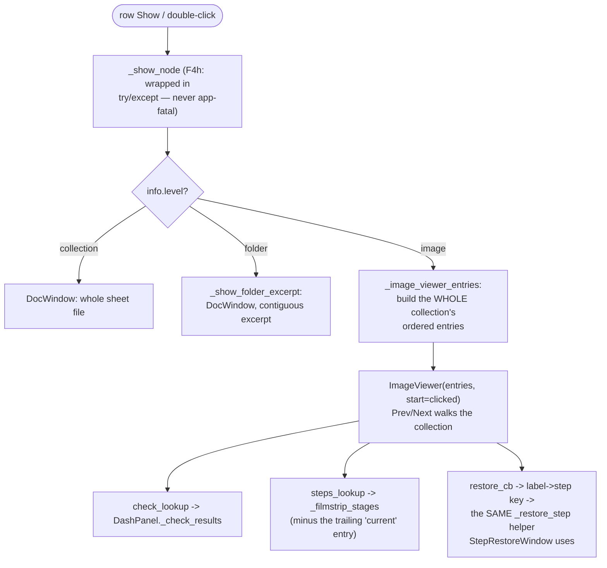

# Settings Mixin — Flow

**About:** [description](../__about/app_settings.md)

## Algorithm — dashboard row "Show" routing (`_show_node`)



## Pseudocode — settings round-trip (`_collect_settings` / `_apply_settings`)

```
FUNCTION collect_settings():
    RETURN {
        output, font_base, theme, geometry, controls_collapsed, dash_mode,
        gemini_key, site_cooldowns (F2, expired entries dropped),
        filter_presets (the shared FilterEditor library),
        agents: {site: panel.get_settings() for each AgentPanel},
        tool_panels: {tile_id: panel.get_settings() for each of the 6},
    }
    # ALWAYS a full overwrite of settings.json — never a merge

FUNCTION apply_settings(stored):
    restore gemini_key, site_cooldowns (start the 30s ticker)
    restore dash_mode
    restore output folder (fall back to default if the saved one is gone)
    FOR EACH agent panel:
        IF old-shape upscale-gate keys present AND no new "up_minside":
            migrate once, log loudly
        panel.apply_settings(migrated dict)
    FOR EACH tool panel:
        IF slot == "upscale": migrate old top-level 'upscale_tool' key
        IF slot == "aspect": migrate old top-level 'aspect_ratio'/
                              'aspect_filter_conditions'/legacy 'aspect_filter'
        panel.apply_settings(migrated dict)
    restore filter_presets, geometry (clamped to screen)
    restore collapsed/expanded Controls state LAST (geometry already sane)
```

Every migration follows the same shape: read the OLD key once, only
when the NEW key is absent; log loudly; never write the old key back
(it naturally drops off disk on the next save).
