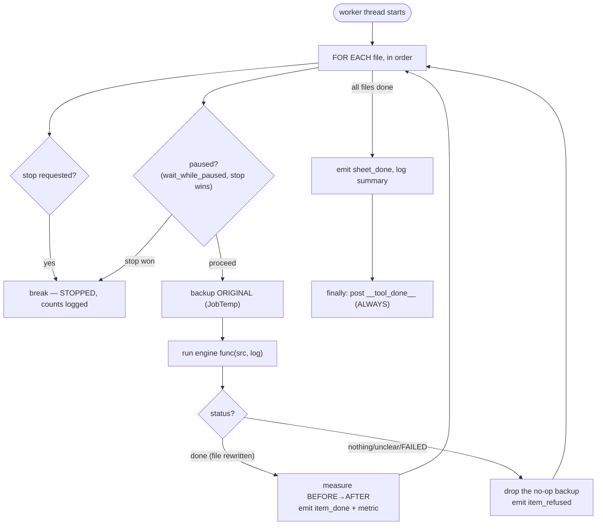

# Tool Jobs Mixin — Flow

**About:** [description](../__about/app_tools.md)

## Algorithm — `_run_tool_job` (one standalone tool's whole run)



## Pseudocode — the AI checker's two-input matching (F6)

```
FUNCTION run_ai_check_job(folder, files, out_base, sheets_path=None):
    prune_stale_flags(out_base)
    IF sheets_path is None:
        pairs = [(file, prompt=None) for file in files]     # quality-only
    ELSE:
        drop_to_prompt = sheet_prompt_map(sheets_path)        # walks a folder too
        pairs = []
        FOR src IN files:
            drop = reverse-lookup src's drop path (dest_for reverse)
            IF drop in drop_to_prompt:
                pairs.append((src, drop_to_prompt[drop]))     # prompt-aware check
            ELSE:
                unmatched += 1                                 # logged, not silent
    FOR (src, prompt) IN pairs, checking stop/pause between each:
        result = ai.check_one_image(src, prompt)
        emit item_flagged / item_ok / item_error accordingly
    emit sheet_done
```

Both `_run_tool_job` and `_run_ai_check_job` check `stop_event`/
`pause_event` at the SAME between-items boundary `run_sheet` itself
uses — the in-flight image/vision call always finishes first, and a
Stop wins over a pending Pause via `wait_while_paused`'s own contract.
