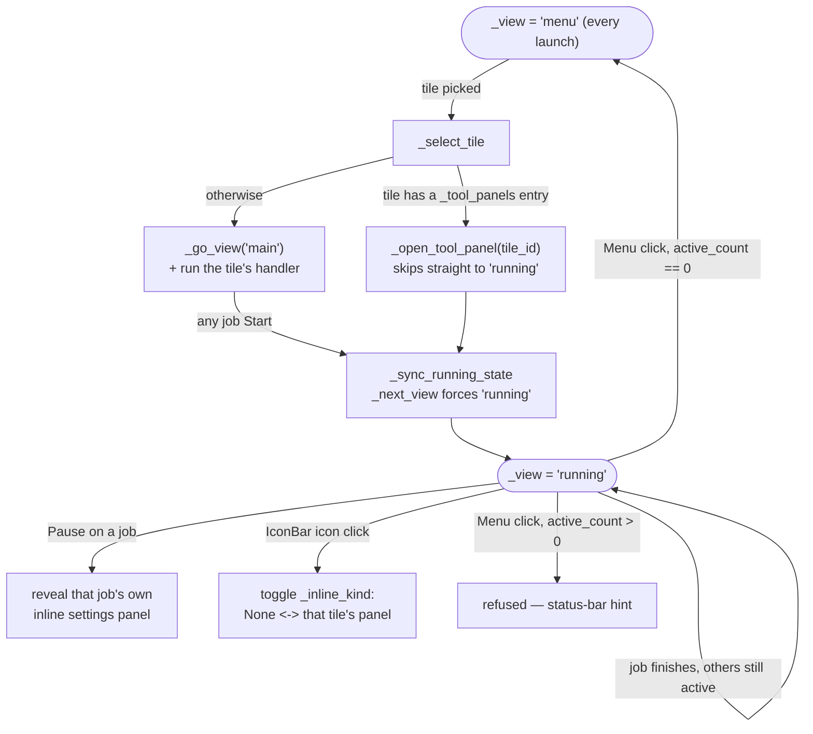

# View Mixin — Flow

**About:** [description](../__about/app_views.md)

## Algorithm — the view state machine



## Pseudocode — `_next_view` (pure, Tk-free — the single source of truth)

```
FUNCTION next_view(current, active_count, menu_requested=False):
    IF menu_requested:
        RETURN "menu" IF active_count == 0 ELSE current
    IF active_count > 0:
        RETURN "running"
    RETURN current
```

- Entering "running" happens automatically the instant any job starts.
- Leaving "running" happens ONLY via an explicit Menu click, and ONLY
  once every job has stopped — closing the last job never auto-jumps.

## Pseudocode — `_apply_running_layout` (what shows under the IconBar)

```
FUNCTION apply_running_layout():
    hide controls_box, compact_box, every tool panel
    show icon_bar
    IF inline_kind is a _tool_panels key:
        show that ONE tool's settings panel
    ELSE IF inline_kind == "website_gen":
        show controls_box (both AgentPanels + the queue)
    ELSE (inline_kind is None — the post-Start default):
        show NOTHING extra — just the IconBar + Dashboard/Log
    recolour every IconBar tile: filled while its job kind is active
```

`_inline_kind` is cleared to `None` on every Start (site or tool) so a
fresh job always lands on the dashboard-alone view; a Pause or an
explicit IconBar click is what brings a settings surface back.
