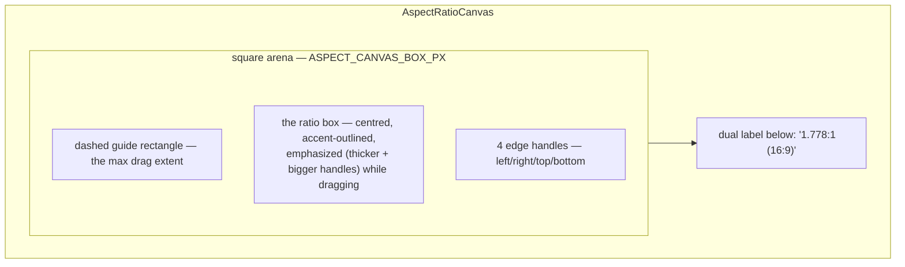
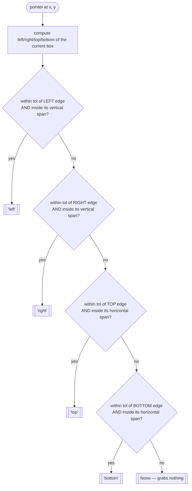

# AspectRatioCanvas — Flow

**About:** [description](../__about/aspect_canvas.md)

## Zones



## Edge-hit test (`_edge_hit`)



## Drag clamp (`_on_drag`) — why an overshoot HOLDS instead of growing

The key idea: the drag tracks a SIDE (e.g. "right"), not an axis. The
effective coordinate is clamped to never cross the centre BEFORE the
half-width is computed — so once the cursor overshoots past the
opposite edge, the half-width simply stops growing instead of
flipping sign and growing again on the other side.

    FUNCTION on_drag(event, drag_edge):
        IF drag_edge is None: RETURN

        IF drag_edge IN ("left", "right"):
            IF drag_edge == "right":
                eff_x = max(event.x, center_x)      # never LEFT of centre
            ELSE:
                eff_x = min(event.x, center_x)       # never RIGHT of centre
            half = clamp(abs(eff_x - center_x), half_min, half_max)
            rect_width_px = half * 2
        ELSE:  # "top" or "bottom", same shape on the Y axis
            IF drag_edge == "bottom":
                eff_y = max(event.y, center_y)
            ELSE:
                eff_y = min(event.y, center_y)
            half = clamp(abs(eff_y - center_y), half_min, half_max)
            rect_height_px = half * 2

        new_w = round(rect_width_px / px_per_unit)
        new_h = round(rect_height_px / px_per_unit)
        changed = (new_w, new_h) != (ratio_w, ratio_h)
        ratio_w, ratio_h = new_w, new_h
        redraw_theme()                    # state updated BEFORE painting
        IF changed AND on_change callback set:
            on_change(new_w, new_h)

Without the `max(event.x, center_x)` / `min(event.x, center_x)` clamp,
a fast drag that overshoots past the box's OPPOSITE edge would make
`eff_x - center_x` cross zero and start growing again from the wrong
side — the box would appear to shrink to nothing then re-grow instead
of holding at its minimum size.

## Programmatic reshape (`set_ratio`) vs. a live drag

```mermaid
flowchart TB
    A(["set_ratio(w, h)"]) --> B{(w, h) == current (ratio_w, ratio_h)?}
    B -- yes --> Z1[["no-op — a drag's own on_change round-trip\nmust never snap the box mid-gesture"]]
    B -- no --> C[ratio_w, ratio_h = w, h]
    C --> D["_fit_to_box: px_per_unit = BOX_PX / max(w, h)\n— the LARGER side exactly fills the arena"]
    D --> E[redraw_theme]
```

`_fit_to_box` never runs mid-drag (`_on_drag` recomputes
`rect_w_px`/`rect_h_px` directly from the pointer) — it only runs on
construction and on the next PROGRAMMATIC `set_ratio` call, so the box
re-snaps to the arena edge only between gestures, never during one.
