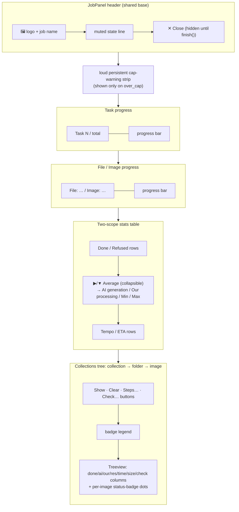
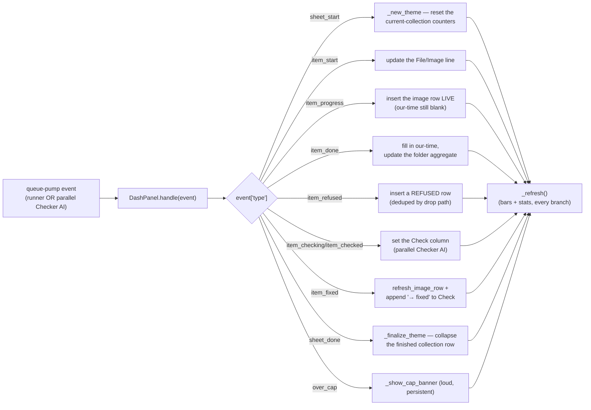

# Dashboard Job Panel Base + Site Panel — Flow

**About:** [description](../__about/dash_panels.md)

## Layout

```mermaid
%%{init: {'flowchart': {'subGraphTitleMargin': {'top': 0, 'bottom': 35}}}}%%
flowchart TB
    subgraph HDR["JobPanel header (shared base)"]
        direction LR
        LG["🖼️ logo + job name"] --> ST["muted state line"] --> CL["✕ Close (hidden until finish())"]
    end
    CAP["loud persistent cap-warning strip<br/>(shown only on over_cap)"]
    subgraph TASK["Task progress"]
        direction LR
        TP["Task N / total"] --- TB["progress bar"]
    end
    subgraph CUR["File / Image progress"]
        direction LR
        FI["File: … / Image: …"] --- IB["progress bar"]
    end
    subgraph STATS["Two-scope stats table"]
        direction TB
        DR["Done / Refused rows"]
        AVG["▶/▼ Average (collapsible)<br/>→ AI generation / Our processing / Min / Max"]
        TE["Tempo / ETA rows"]
        DR --> AVG --> TE
    end
    subgraph TREE["Collections tree: collection → folder → image"]
        direction TB
        TH["Show · Clear · Steps… · Check… buttons"]
        LEG["badge legend"]
        TV["Treeview: done/ai/our/res/time/size/check columns<br/>+ per-image status-badge dots"]
        TH --> LEG --> TV
    end
    HDR --> CAP --> TASK --> CUR --> STATS --> TREE
```

## Event dispatch (`handle`)

```mermaid
%%{init: {'flowchart': {'subGraphTitleMargin': {'top': 0, 'bottom': 35}}}}%%
flowchart LR
    Q["queue-pump event<br/>(runner OR parallel Checker AI)"] --> H["DashPanel.handle(event)"]
    H --> K{"event['type']"}
    K -- sheet_start --> NT["_new_theme — reset the<br/>current-collection counters"]
    K -- item_start --> IS["update the File/Image line"]
    K -- item_progress --> IP["insert the image row LIVE<br/>(our-time still blank)"]
    K -- item_done --> ID["fill in our-time,<br/>update the folder aggregate"]
    K -- item_refused --> IR["insert a REFUSED row<br/>(deduped by drop path)"]
    K -- item_checking/item_checked --> IC["set the Check column<br/>(parallel Checker AI)"]
    K -- item_fixed --> IF["refresh_image_row +<br/>append '→ fixed' to Check"]
    K -- sheet_done --> SD["_finalize_theme — collapse<br/>the finished collection row"]
    K -- over_cap --> OC["_show_cap_banner (loud, persistent)"]
    NT & IS & IP & ID & IR & IC & IF & SD & OC --> RF["_refresh()<br/>(bars + stats, every branch)"]
```
