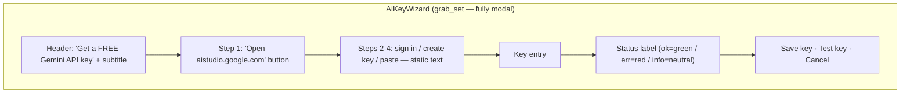

# Modal Dialogs — Flow

**About:** [description](../__about/dialogs.md)

## Layout — AiKeyWizard (modal)

## AiSheetDialog — retired (faza 4)

The two-phase request → questions → sheet flow moved into the
persistent [Sheet Generator Panel](../__about/sheetgen_panel.md)
(wizard ① Zahtev → ② Pitanja → ③ Draft & Save) — same engine
calls, editable parser-revalidated draft instead of the DocWindow
detour.
