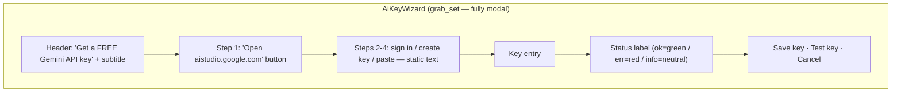
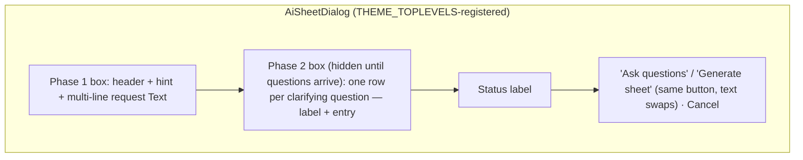
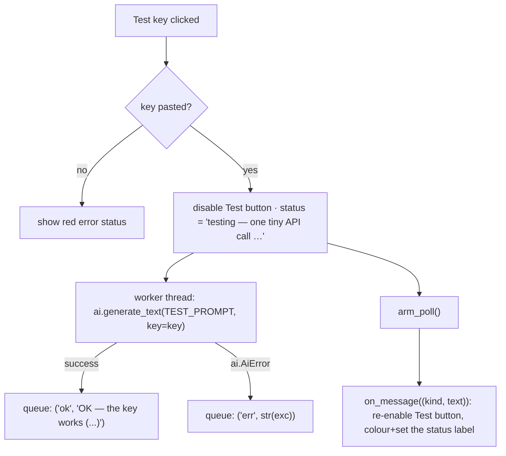
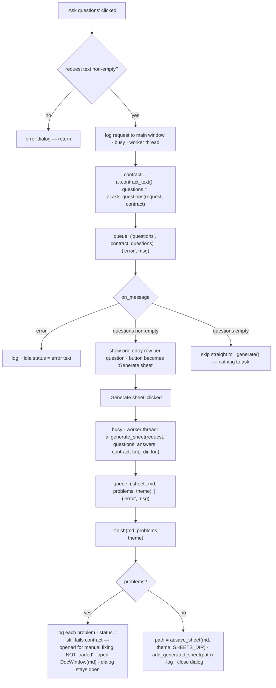

# Modal Dialogs — Flow

**About:** [description](../__about/dialogs.md)

## Layout — AiKeyWizard (modal)



## Layout — AiSheetDialog (non-modal, two phases)



## Algorithm — shared worker-queue poll loop (`_AiDialog`)

```
init_ai_queue():  q = Queue();  poll_job = None

arm_poll():  poll_job = after(AI_POLL_MS, poll)

poll():
    poll_job = None
    if window destroyed: return          # closed mid-work — result is moot
    if a message is queued: on_message(message)   # subclass-specific
    else: arm_poll()                     # try again next tick
```

Every worker thread ONLY calls `self._q.put(...)` — it never touches
a Tk widget; only `poll()`'s `on_message` runs on the main thread.

## Algorithm — AiKeyWizard "Test key"



## Algorithm — AiSheetDialog two-call flow


