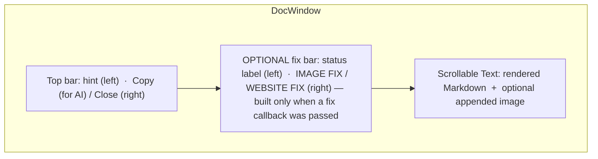
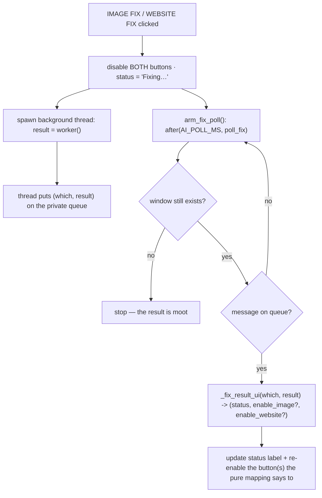

# Doc Window — Flow

**About:** [description](../__about/doc_window.md)

## Layout



## Algorithm — two-phase sizing (width first, then content-fit height)

```
_apply_width():                      # runs in __init__, BEFORE render
    if image_path given:
        width = image.native_width + DOC_IMG_PAD_PX      # IMAGE mode
    else:
        width = screen_height * DOC_HEIGHT_FRAC * DOC_A4_RATIO   # TEXT mode
    width = clamp(width, DOC_MIN_W, screen_width * DOC_MAX_FRAC)
    set geometry(width x a tall PROVISIONAL height)       # real height unknown yet

_render(markdown) + _append_image()  # fills the Text at the now-fixed width

on first <Map> event (window is actually laid out on screen):
    _fit_height():
        content_h = Text.count("1.0", "end", "ypixels")   # the REAL wrapped height
        needed = content_h + chrome_height(bars + padding)
        height = clamp(needed, DOC_MIN_H, screen_height * DOC_MAX_FRAC)
        set geometry(target_width x height)                # snaps to real content
```

Measuring in `__init__` would read a zero-height Text (nothing is
laid out until the window is mapped) — that is why the fit happens on
`<Map>`, one-shot, rather than at construction time.

## Algorithm — Fixer-AI manual buttons (worker-thread + poll loop)



Both buttons disable together while one fix is in flight — a second
fix started before the first lands would race the same file. The pure
decision (`_fix_result_ui`, in `gui/logic.py`) is Tk-free and unit
tested on its own; this window only applies its 3-tuple to real
widgets.
