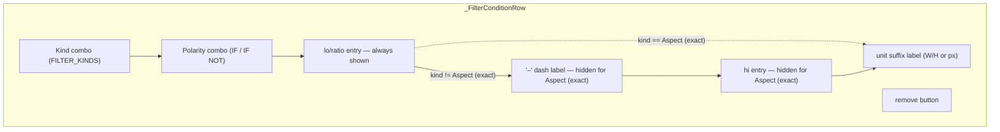
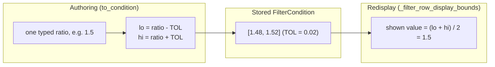

# FilterEditor — Flow

**About:** [description](../__about/filter_editor.md)

## Row layout — `_sync_layout`



Every kind change re-packs the row with `after=` so the left-to-right
order stays correct no matter how many times the kind has flipped
back and forth — the fields themselves are never destroyed/rebuilt,
only shown or hidden.

## Exact-aspect widen/narrow round trip



The round trip is exact as long as `FILTER_ASPECT_EXACT_TOL` has not
changed between save and load — the widget never stores the original
typed ratio itself, only the widened band, so the tolerance constant
IS part of the persisted shape.

## `get_conditions()` validation

```mermaid
flowchart TB
    A([get_conditions]) --> B[for each row, call to_condition]
    B --> C{lo/ratio field parses as float?}
    C -- no --> X1[["raise ValueError: '<kind>: the value must be a number.'"]]
    C -- yes --> D{kind == Aspect (exact)?}
    D -- yes --> E["return FilterCondition(lo=ratio-TOL, hi=ratio+TOL)"]
    D -- no --> F{hi field parses as float?}
    F -- no --> X2[["raise ValueError: '<kind>: the TO value must be a number.'"]]
    F -- yes --> G{lo <= hi?}
    G -- no --> X3[["raise ValueError: '<kind>: FROM must be <= TO.'"]]
    G -- yes --> H["return FilterCondition(lo, hi)"]
```

`get_conditions()` never returns a partial list — the FIRST bad row
raises immediately and stops the whole pass; the caller decides how to
surface the message (`_save_preset`, this module's own caller, shows
it in a messagebox naming the offending kind).
