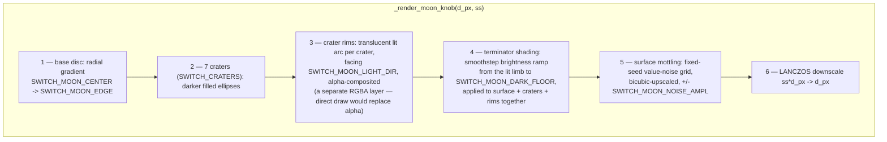

# Icon Loading + Switch Art — Flow

**About:** [description](../__about/icons.md)

## icon() resolution

```mermaid
flowchart TB
    A([icon: name, size]) --> B{"(name, size) in _ICONS cache?"}
    B -- yes --> Z[["return cached CTkImage"]]
    B -- no --> C{name.svg exists AND\nno Tiny-unsupported tag?}
    C -- yes --> D[_svg_to_pil: rasterize at 4x, LANCZOS down]
    C -- no --> E{name.png exists?}
    E -- yes --> F[open png, LANCZOS-downscale to fit size]
    E -- no --> G{name.svg exists\nbut Tiny-unsupported?}
    G -- yes --> X1[["raise FileNotFoundError\n— needs a pre-rasterized .png sibling"]]
    G -- no --> X2[["raise FileNotFoundError — icon missing entirely"]]
    D --> H[wrap as CTkImage, cache under (name, size)]
    F --> H
    H --> Z
```

Tiny-unsupported tag sniff: the raw svg bytes are scanned for
`<clipPath`, `<mask` or `<filter` — any hit routes to the PNG branch
(or the loud error if no PNG sibling exists) instead of attempting a
render QtSvg would silently mangle.

## Switch knob rendering pipeline

The moon knob layers, back to front, all on one supersampled canvas
(downscaled once at the end for the anti-aliased edge):



Pseudocode (language-neutral) for the terminator + mottling pass —
the part with real math, after craters/rims are already composited:

    FUNCTION shade_and_mottle(disc, light_dir, dark_floor, noise_seed, noise_amplitude):
        FOR EACH pixel (x, y) in disc:
            normalized = ((x, y) - center) / radius        # range [-1, 1]
            proj = dot(normalized, light_dir) / length(light_dir)
            # proj = +1 at the lit limb, -1 at the far limb
            u = clamp((proj + softness) / (2 * softness), 0, 1)
            u = smoothstep(u)                                # ease across the band
            brightness = dark_floor + (1 - dark_floor) * u
            pixel.rgb = pixel.rgb * brightness

        noise_grid = seeded_random(noise_seed, small_cell_count)
        noise_upscaled = bicubic_resize(noise_grid, disc.size)
        FOR EACH pixel in disc:
            pixel.rgb += noise_upscaled[pixel] * noise_amplitude
        # alpha channel is untouched throughout — only RGB shades

The sun knob is simpler: a blurred low-alpha gold disc (the glow,
`GaussianBlur`-ed) with the gradient sun disc alpha-composited on top,
centred, then downscaled the same way. The track pills and the
theme-cover icon reuse these same renderers rather than drawing their
own art — see the `__about` doc's Functions list.
