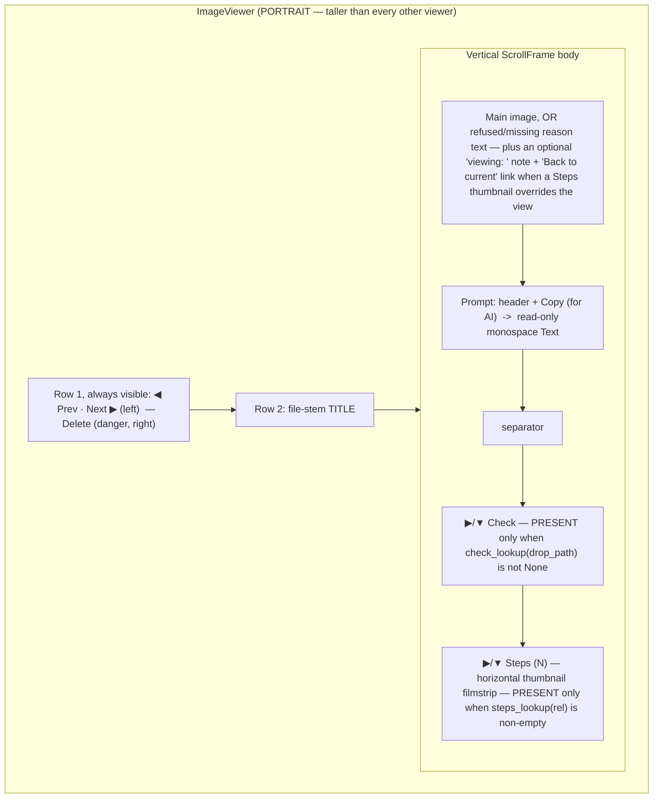
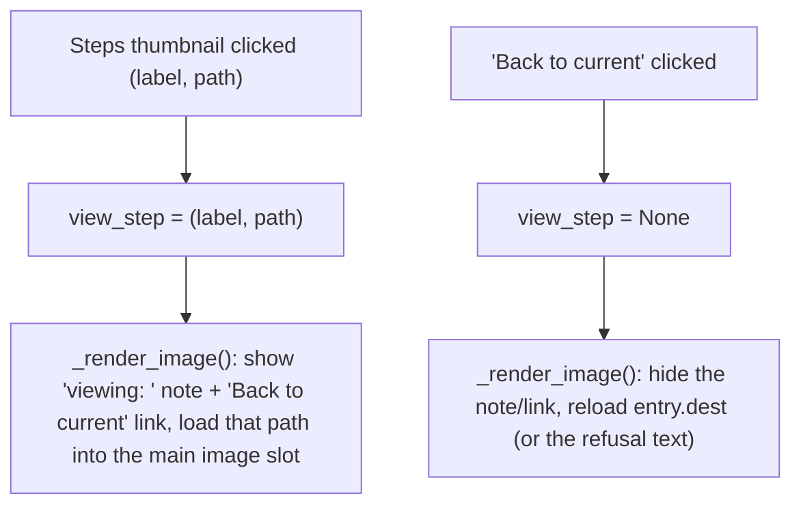

# Image Viewer — Flow

**About:** [description](../__about/image_viewer.md)

## Layout



Row 1 sits OUTSIDE the scroll area on purpose — Prev/Next/Delete can
never scroll out of reach. Check and Steps keep FIXED outer frames
packed for the viewer's whole lifetime (only their inner
button+body toggle pack/pack_forget) so one entry having Steps but
not Check, and the next having both, can never reorder the two
sections relative to each other.

## Algorithm — per-entry render

```
_render_entry():
    view_step = None                 # any Steps preview override resets
    update title (dest's stem, or the drop path's stem if nothing saved)
    update Prev/Next enabled state (disabled at list ends)
    update Delete enabled state (disabled when entry.dest is None)
    render main image (or the refusal/missing-reason text)
    render prompt text
    refresh_check_section()          # may hide the whole section
    refresh_steps_section()          # may hide the whole section
```

## Algorithm — section presence gate (the real "lookup-gated" rule)

```
refresh_check_section():
    result = check_lookup(entry.drop_path) if check_lookup is not None else None
    if result is None:
        HIDE the Check button + body entirely
    else:
        render ai_check_doc_md(...) into the body Text
        show the ▶/▼ expander button

refresh_steps_section():
    stages = steps_lookup(entry.rel) if (steps_lookup is not None and entry.rel) else []
    if stages is empty:
        HIDE the Steps button + body entirely
    else:
        build the horizontal thumbnail filmstrip
        show the ▶/▼ expander button (N = stage count)
```

`check_lookup`/`steps_lookup` themselves come from
`SettingsMixin._image_viewer_check_lookup(panel)` /
`_image_viewer_steps_lookup(panel)` — BOTH are `None` outright
whenever `panel` (the clicking site's live `DashPanel`, looked up as
`self.panels.get(site_key)`) is `None`. So the actual gate is two
layers: (1) does a live dashboard panel for this site still exist
this session, and only if so, (2) does THIS entry have a check result
/ backed-up step. Layer 1 hides both sections outright even when
on-disk history exists, purely because the panel object is gone.

## Algorithm — Steps thumbnail preview (no new Toplevel)



## Algorithm — Restore-to-step / Delete

```
_restore_this_step(label):
    rel = entry.rel; step = restore_cb is None ? skip : call restore_cb(rel, label)
    if restore_cb(rel, label) succeeds:
        _render_entry()              # the live file changed on disk — full redraw
        on_restored(entry)           # caller refreshes the dashboard row

_delete_current():
    confirm dialog — explicitly states this targets the SAVED file,
        never a Steps preview, even if one is currently shown
    unlink entry.dest from disk
    entry.dest = entry.rel = None; entry.refused_reason = "Deleted from the viewer."
    on_deleted(entry)
    if a next entry exists: advance to it (_render_entry)
    else: close the window
```
