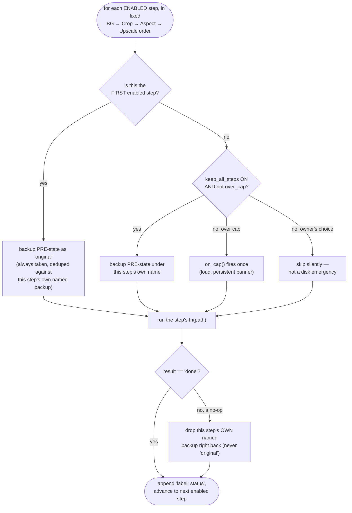
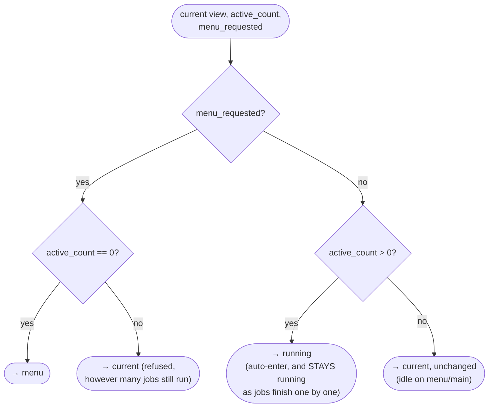

# Pure Logic Helpers — Flow

**About:** [description](../__about/logic.md)

## Pipeline-step runner (`_run_pipeline_steps`)



Pseudocode:

```
took_original = False
FOR EACH (label, step_name, fn) IN steps:   # already fixed pipeline order
    backed_up_as = NONE
    IF temp is attached:
        IF NOT took_original:
            temp.backup(path, step="original")   # ALWAYS, cap or not
            took_original = True
        ELSE IF NOT keep_all_steps:
            pass                                  # owner's choice, silent
        ELSE IF NOT temp.over_cap():
            temp.backup(path, step=step_name)
            backed_up_as = step_name
        ELSE:
            on_cap()                               # loud, once
    status = fn(path)
    IF backed_up_as is set AND status != "done":
        temp.drop(step=backed_up_as)               # no-op — nothing to restore
    record "label: status"
RETURN joined "label: status, label: status, ..."
```

## View-transition state machine (`_next_view`)



Pseudocode:

```
IF menu_requested:
    RETURN "menu" IF active_count == 0 ELSE current   # refused otherwise
IF active_count > 0:
    RETURN "running"     # 0 -> >=1 auto-enters; stays "running" all
                          # the way down to 0 — only an EXPLICIT later
                          # Menu click (case above) ever leaves it
RETURN current
```
