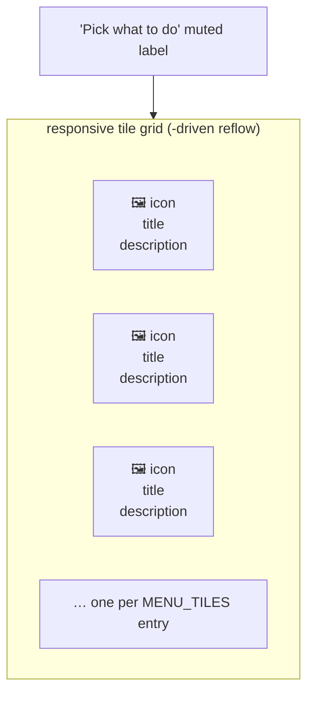
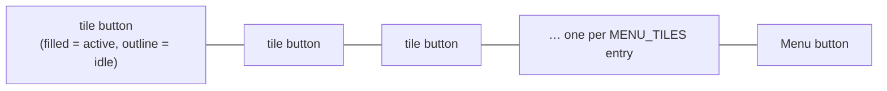

# Main Menu + Icon Bar — Flow

**About:** [description](../__about/menu.md)

## MainMenu zones



Pseudocode for the reflow guard (`_on_grid_configure`):

```
on grid <Configure>(new_width):
    cols = _menu_tile_columns(new_width, tile_count)   # pure, shared
                                                          # with IconBar's
                                                          # own column floor
    IF cols == self._cols:
        do nothing                # per-pixel resizes rarely cross an
                                   # integer column threshold
    ELSE:
        _reflow(cols):
            reset EVERY column/row weight to 0, clear their
                "uniform" group tag (a stale group membership from a
                LARGER previous cols skews Tk's shared-width calc)
            re-grid each tile at (row, col) = divmod(index, cols)
            reassign weight=1 + minsize=MENU_TILE_CELL_MIN_PX to only
                the columns/rows actually in use this pass
```

## IconBar zones



`set_active(active_ids)` — the ONLY thing that changes after
construction: every enabled tile whose id is in `active_ids` gets the
FILLED accent style, every other enabled tile a quiet outline; a
disabled tile is never touched again (styled once at construction and
left greyed/inert).
