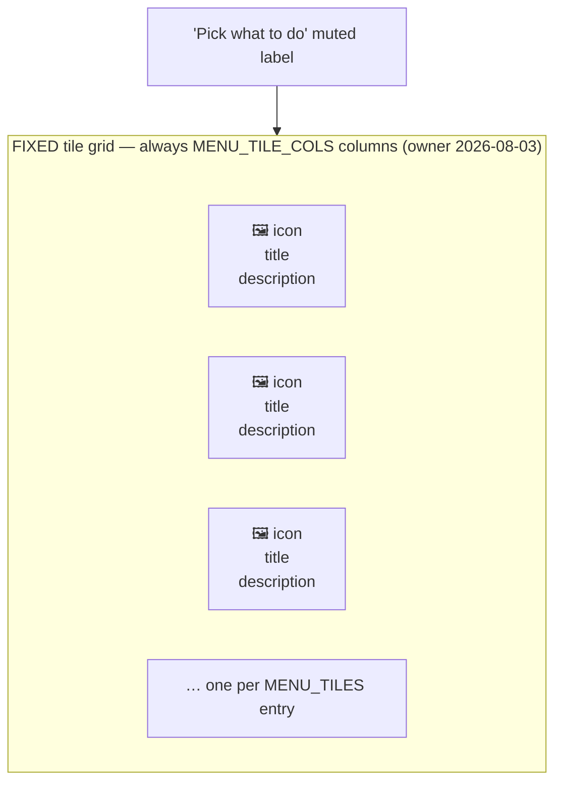
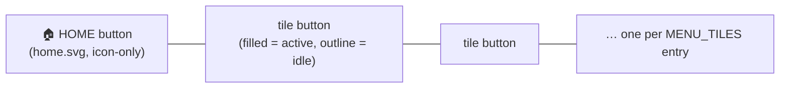

# Main Menu + Icon Bar — Flow

**About:** [description](../__about/menu.md)

## MainMenu zones



Pseudocode for the fixed grid + the computed window minimum
(`MainMenu.__init__` + `BuildMixin._apply_min_size`):

```
build once:
    grid each tile at (row, col) = divmod(index, MENU_TILE_COLS)
    every column: weight=1, uniform, minsize=cell_min_px()
                  # = max(MENU_TILE_CELL_MIN_PX, widest tile content
                  #       + hover border + text margin + GAP)
    every row:    weight=1, uniform, minsize=MENU_TILE_H + GAP

_apply_min_size (end of __init__, and after every font-zoom step):
    update_idletasks                       # honest measurements
    chrome_w = 2*OUTER_PAD + 2*MENU_GRID_PADX + vbar.reqwidth
    chrome_h = top_strip.reqheight + menu.chrome_height() + 2*OUTER_PAD
    cell = menu.cell_min_px()      # measured; re-applied as column minsize
    (w, h) = menu_min_size(len(MENU_TILES), chrome_w, chrome_h, cell)  # pure
    root.minsize(max(w, WINDOW_MIN_W), max(h, WINDOW_MIN_H))
    # __init__ then OPENS the window at exactly that (w, h)
    # -> the window can NEVER get too narrow/short for the whole 4x2
    #    grid; the menu never scrolls (ScrollFrame's bar auto-hides
    #    when content fits)
```

## IconBar zones



Pseudocode for the icon-only responsiveness (`_on_configure`, owner
2026-08-03 — "sve opcije uvek vidljive, nikad sečene"):

```
on bar <Configure>(allocated_width):
    IF text mode AND full_w unmeasured:
        full_w = bar.reqwidth              # lazy, at the current font
    IF text mode AND allocated_width < full_w:
        _set_icon_only(True)               # EVERY tile label dropped
                                            # at once — uniform strip
    ELIF icon-only AND allocated_width >= full_w + HYSTERESIS:
        _set_icon_only(False)              # labels return; full_w
                                            # cleared -> re-measured
                                            # (heals a zoom that
                                            # happened while icon-only)
```

`set_active(active_ids)` — the ONLY other thing that changes after
construction: every enabled tile whose id is in `active_ids` gets the
FILLED accent style, every other enabled tile a quiet outline; a
disabled tile is never touched again (styled once at construction and
left greyed/inert). HOME never recolours — it is not a tile.
