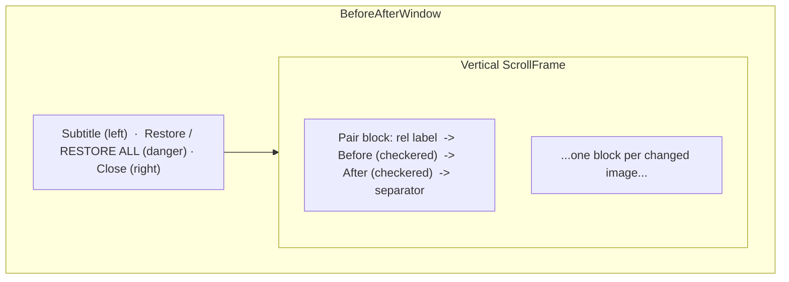
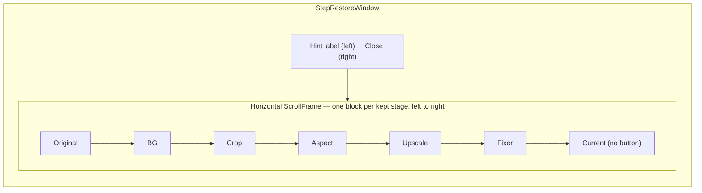
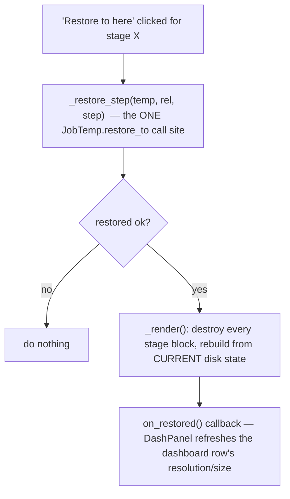

# Restore Viewers — Flow

**About:** [description](../__about/restore_windows.md)

## Layout — BeforeAfterWindow (single or multi image)



## Layout — StepRestoreWindow (per-image pipeline filmstrip)



Each stage block is: stage label, thumbnail (checkerboard-composited
via `_scaled_photo(..., on_checker=True)`), and a "Restore to here"
button — except the trailing "Current" block, which has no button
because it already IS the live state. Only stages the job's temp
store actually backed up appear; a job that never ran BG removal, for
instance, has no "BG" block.

## Algorithm — `_filmstrip_stages` (pure, Tk-free)

```
filmstrip_stages(temp, rel, live_path):
    stages = []
    for step in temp.steps_for(rel):        # pipeline order, only backed-up steps
        stages.append( (JOBTEMP_STEP_LABEL[step], temp.before_path(rel, step)) )
    stages.append( (STEP_RESTORE_CURRENT_LABEL, live_path) )   # exactly one trailing entry
    return stages
```

`stages[:-1]` zips 1:1 against `temp.steps_for(rel)` — same order,
same length — so a caller (`StepRestoreWindow._render`) can pair each
display row with its raw `JobTemp` step key.

## Algorithm — restore + re-render in place



The filmstrip never diffs old vs new state — every restore triggers a
full rebuild straight from `_filmstrip_stages`, so the Current
thumbnail and the remaining restorable stages are always exactly what
is on disk right now.
