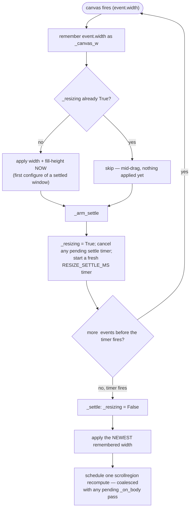
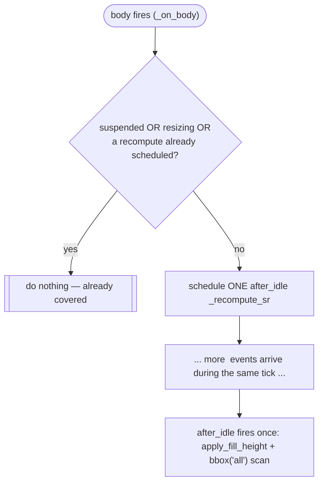

# ScrollFrame — Flow

**About:** [description](../__about/scroll.md)

## Resize debounce (`_on_canvas` -> `_settle`)

Pseudocode:

    ON canvas.Configure(event):
        canvas_w = event.width                  # always remember the newest
        IF NOT resizing:
            apply_width(canvas_w)                # first-configure exception
            apply_fill_height()
        arm_settle()                             # (re)start the debounce timer

    FUNCTION arm_settle():
        resizing = True
        cancel(pending_settle_timer)
        pending_settle_timer = after(RESIZE_SETTLE_MS, settle)

    FUNCTION settle():
        resizing = False
        apply_width(canvas_w)        # the LATEST width, applied exactly once
        schedule_scrollregion_recompute()   # coalesced, see below

## Scrollregion coalescing (`_on_body` -> `_recompute_sr`)

A bulk build (Expand-all in the Select window) grids dozens of
children, each firing its own body `<Configure>`. Recomputing
`bbox('all')` — an O(current content) scan — on every single one would
be O(N^2) over the whole build.

`suspend_scrollregion()`/`resume_scrollregion()` wrap a bulk build:
suspend sets the guard so every `_on_body` call during the build is a
no-op, resume schedules exactly one recompute at the end — the whole
Expand-all costs ONE `bbox` scan instead of one per grided child.
`refresh()` is the same coalesced schedule, called explicitly by a
host that reveals/hides content in a way no `<Configure>` here would
otherwise catch (see the `__about` doc's Design Decisions).
