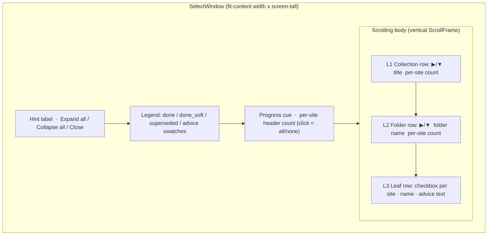
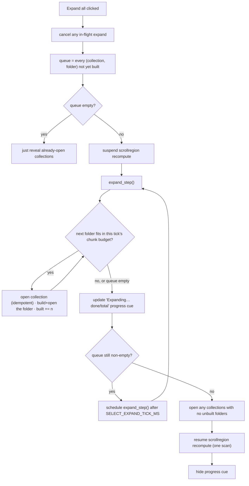

# Select-Images Window — Flow

**About:** [description](../__about/select_window.md)

## Layout



L1/L2 rows are always materialised (cheap — a few dozen). L3 leaf rows
are the expensive part — see the algorithm below.

## Algorithm — lazy leaf build/destroy

```
on folder OPEN:
    if not built:
        build one ttk row per leaf (checkbox + name + advice text)
        mark built
    reveal the folder's children frame

on folder CLOSE:
    destroy every leaf row widget (winfo_children().destroy())
    clear leaf_labels, mark not built
    hide the folder's children frame
```

Live widgets never accumulate beyond what is currently expanded — a
collapsed folder holds zero leaf widgets, however large the queue.

## Algorithm — chunked Expand-all

A synchronous "build every leaf" pass would freeze the main thread
(~3s at the owner's real queue). Instead it runs as folder-atomic
chunks across scheduled ticks:



A folder is never split across ticks — the chunk budget
(`SELECT_EXPAND_CHUNK` leaves) is a soft cap the current folder may
exceed by staying whole, so the tree is always in a consistent
built-or-not state to stop at. Cancelling (a manual toggle, or
Collapse-all) mid-run leaves whatever was built open+built and the
rest closed+unbuilt — no partial folder.

## Algorithm — coalesced recount

```
on any leaf checkbox's BooleanVar write:
    dirty = True
    if no recount already scheduled:
        schedule recount() via after_idle

recount():                       # runs once per idle tick, not once per click
    if not dirty: return
    dirty = False
    for each site key:
        selected = sum(var.get() for every leaf's var)
        update the header label "site  selected/total"
    for each L1/L2 node (cached scope list):
        selected = sum(var.get() for leaves in that scope)
        update that node's own count cell
```

An all/none click over dozens of vars still costs exactly one
recount pass, not one per toggled var.
