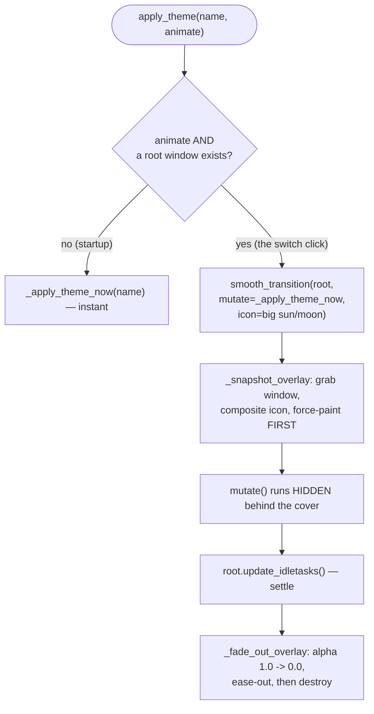
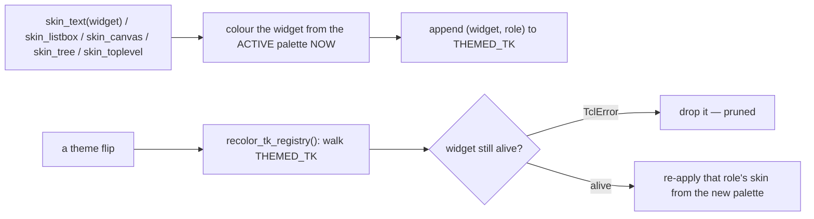

# The Theme Engine — Flow

**About:** [description](../__about/theme.md)

## Algorithm — `apply_theme(name, animate)`



## Pseudocode — `_apply_theme_now` (the coherent flip itself)

```
FUNCTION apply_theme_now(name):
    widgets.ACTIVE_THEME = name            # the live global, module-attr write
    ttkbootstrap.Style().theme_use(THEMES[name].ttkname)
    setup_style()                          # re-derive the few named ttk styles
    customtkinter.set_appearance_mode(THEMES[name].mode)   # every CTk tuple flips
    recolor_tk_registry()                  # re-walk THEMED_TK, prune dead widgets
    FOR EACH open Toplevel in THEME_TOPLEVELS:
        top.apply_theme()                  # per-widget foregrounds ttk can't reach
```

No window is ever torn down — worker threads, dashboard counters and
quota countdowns all survive untouched.

## Algorithm — the plain-tk skin registry


