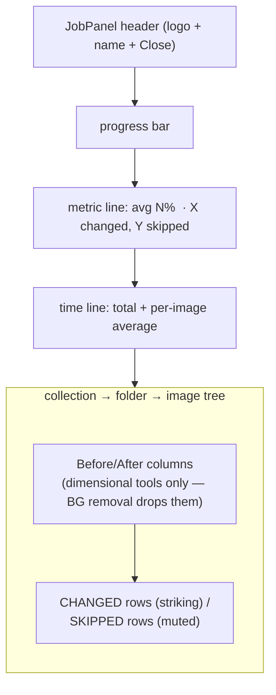
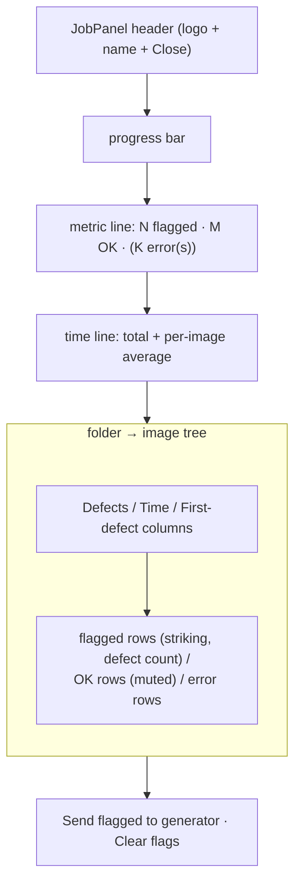
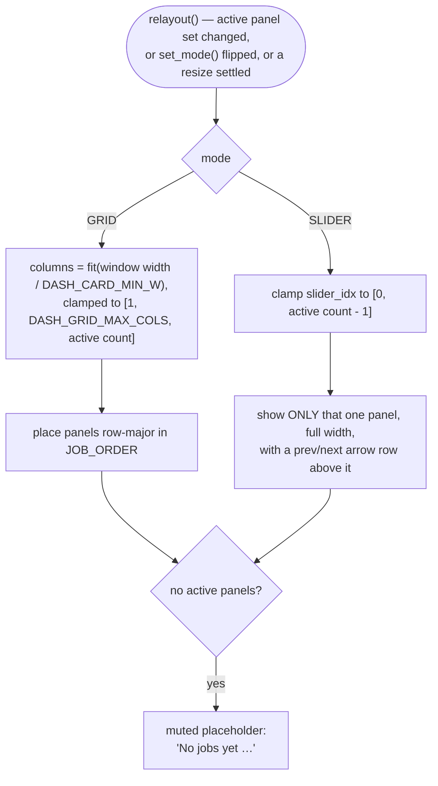

# Tool + AI-Checker Dashboard Panels + Grid — Flow

**About:** [description](../__about/tool_dash.md)

## ToolPanel zones



Double-click routing (`_on_activate`):

```
image row    → before/after viewer for THIS image, Restore reverts it
folder node  → before/after viewer for THIS FOLDER's changed images,
               RESTORE ALL reverts only this folder
top node     → before/after viewer for the WHOLE job's changed images,
               RESTORE ALL reverts everything
```

## AiCheckPanel zones



## DashGrid — two modes (F4e)


