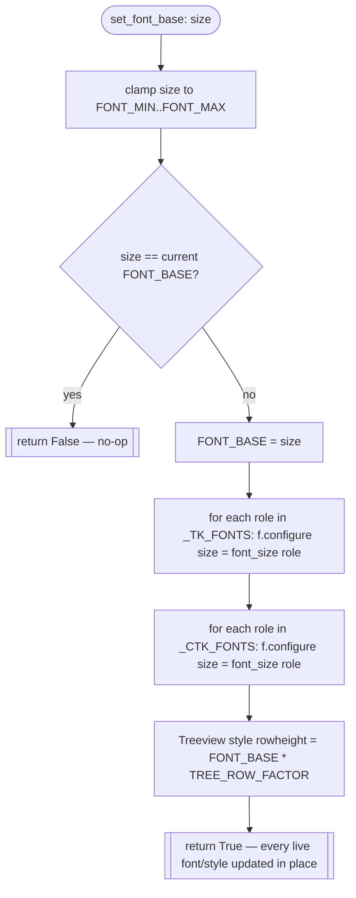
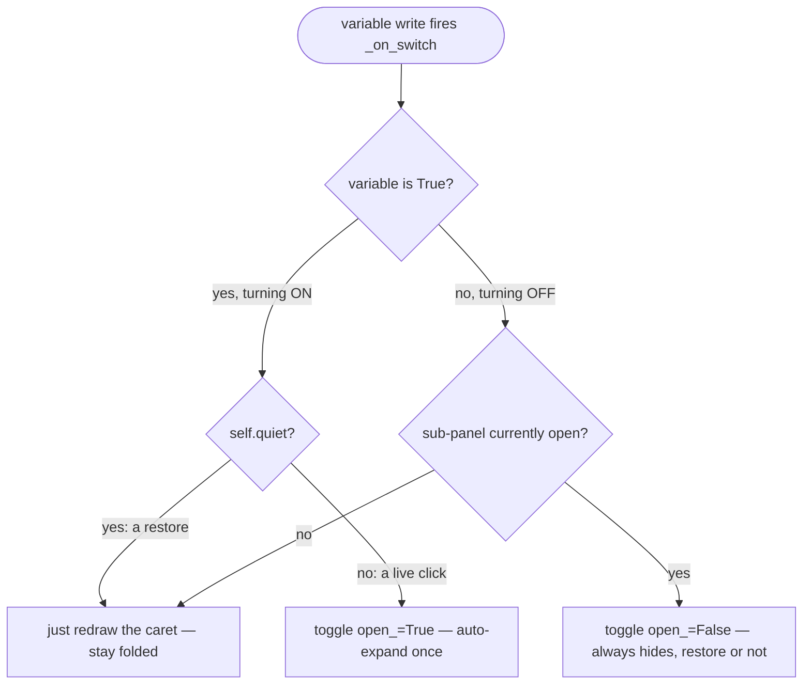

# Themed Widget Toolkit — Flow

**About:** [description](../__about/widgets.md)

## Font-zoom rescale (`set_font_base`)

Every role's font is a single SHARED `tk.font.Font` / `ctk.CTkFont`
object reused by every widget/style/tag that asked for that role — a
`.configure(size=...)` on the shared object propagates to all of them
automatically, so the loop above is the ENTIRE rescale; no widget walk
is needed.

## ExpandableSwitch — click vs. restore

The tricky part: a Tk variable write-trace cannot tell "the owner
clicked the switch" from "a settings restore just called `.set()`" —
both fire the same trace callback. The `quiet` flag (set only through
`quiet_restore`) is what tells them apart.

Pseudocode for `toggle(open_)`, the shared pack/unpack the click and
the restore-driven OFF path both fund into:

    FUNCTION toggle(open_wanted):
        IF build_sub is None: RETURN                 # plain switch, no sub
        IF open_wanted AND NOT variable.get(): RETURN # sub only exists while ON
        IF open_wanted AND NOT built:
            build_sub(sub_frame)                       # lazy first build
            built = True
        IF open_wanted == currently_open:
            render_caret(); RETURN                     # nothing changed
        currently_open = open_wanted
        IF open_wanted: sub_frame.pack(indented)
        ELSE:           sub_frame.pack_forget()
        render_caret()
        on_layout_change()      # tells an outer ScrollFrame to re-fit

`quiet_restore(*switches)` is a context manager: set `.quiet = True` on
every switch passed in, `yield`, then always reset it to `False` in a
`finally` — so a restore that raises partway through still leaves
every switch back in live-click mode.
