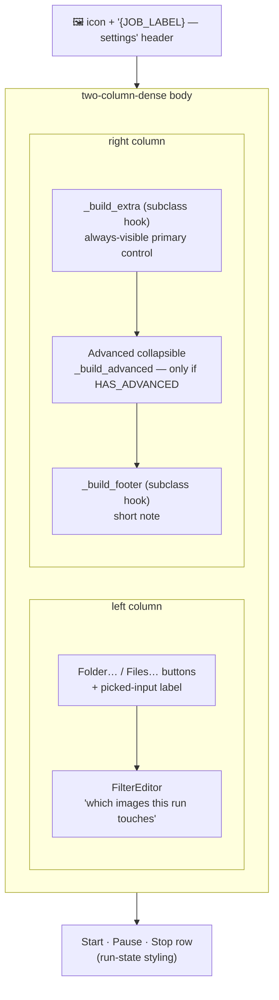

# Base Tool Settings Panel — Flow

**About:** [description](../__about/base.md)

## Layout

**Advanced toggle** (`_toggle_advanced`): flips
`_advanced_collapsed_var`, then `smooth_transition` covers the mutate
— `_apply_advanced_visibility` packs/unpacks `_advanced_box` and
relabels the gear button, then `_on_layout_change()` fires so the
outer `ScrollFrame` can refit.
