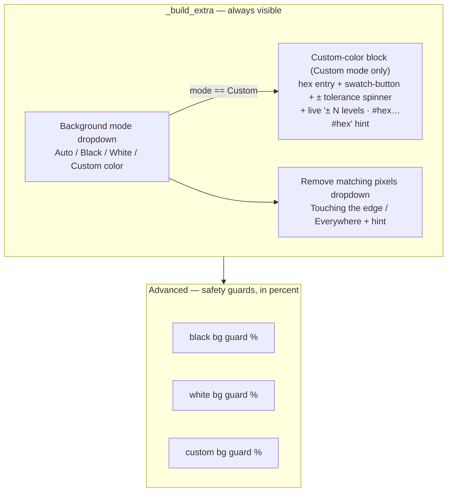

# BG Settings Panel — Flow

**About:** [description](../__about/bg.md)

## Layout

Fills the [Base Tool Settings Panel](../__flow/base.md) `_build_extra`
(right-column, above Advanced) and `_build_advanced` zones:

Pixel-picking a swatch color opens `ColorChooserDialog` as a modal
over this panel, not a zone of it.
