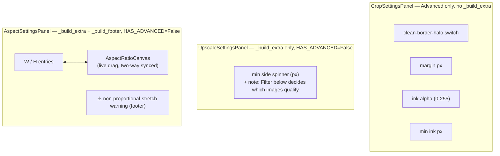

# Geometry Settings Panels — Flow

**About:** [description](../__about/geometry.md)

## Layout

Three independent panels, each filling the
[Base Tool Settings Panel](../__flow/base.md)'s `_build_extra` /
`_build_advanced` / `_build_footer` zones differently:

`CropSettingsPanel` has no `_build_extra` (its body is the base chrome
alone, plus Advanced); `UpscaleSettingsPanel`/`AspectSettingsPanel`
have no Advanced collapsible at all (`HAS_ADVANCED = False`) — their
one primary control is always visible instead.
