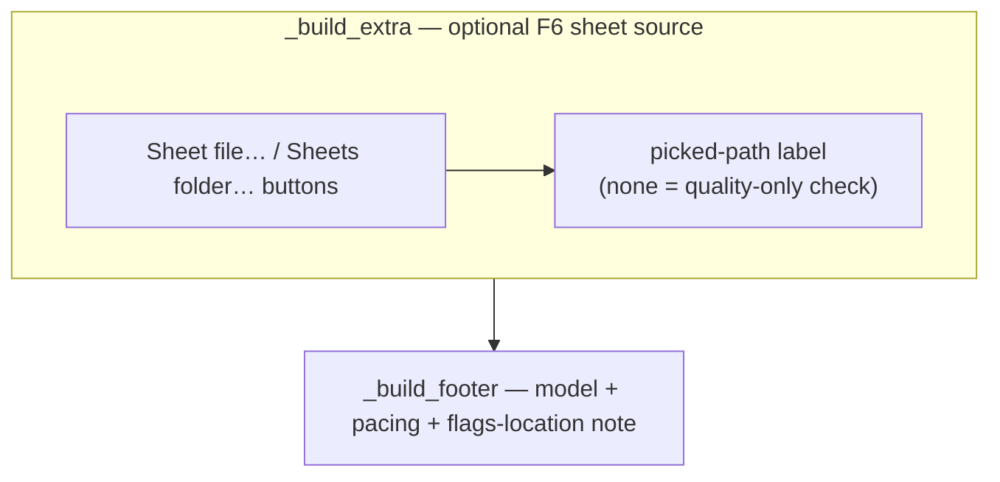

# Image Checker Settings Panel — Flow

**About:** [description](../__about/image_checker.md)

## Layout

Fills the [Base Tool Settings Panel](../__flow/base.md)'s
`_build_extra` and `_build_footer` zones; `HAS_ADVANCED = False` so
there is no Advanced gear at all:

Start is wired straight to `PainterGui._start_ai_check`, bypassing
`build_func` — no engine-callable zone exists on this panel.
