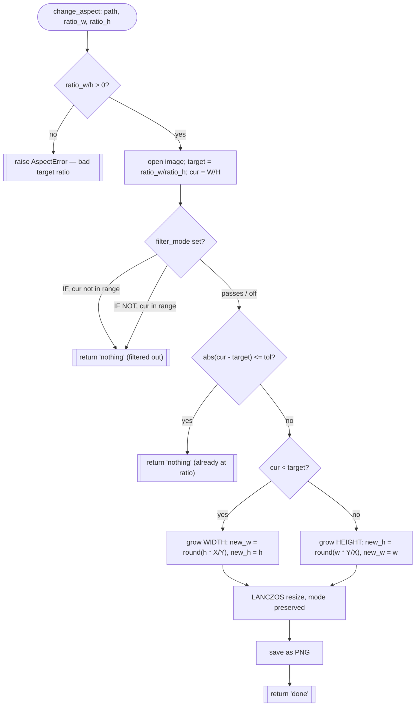

# Change Aspect Ratio — Flow

**About:** [description](../__about/aspect.md)

## Algorithm

Pseudocode (language-neutral):

    FUNCTION change_aspect(path, ratio_w, ratio_h, tol, filter):
        IF ratio_w <= 0 OR ratio_h <= 0:
            RAISE AspectError("target ratio must be positive")

        image = open(path)
        target = ratio_w / ratio_h
        cur    = image.width / image.height

        IF filter.mode == "IF" AND cur NOT IN [filter.from, filter.to]:
            RETURN "nothing"
        IF filter.mode == "IF NOT" AND cur IN [filter.from, filter.to]:
            RETURN "nothing"

        IF |cur - target| <= tol:
            RETURN "nothing"          # already at ratio, byte-unchanged

        IF cur < target:
            # too tall/narrow for the target — grow the WIDTH
            new_w, new_h = round(height * ratio_w / ratio_h), height
        ELSE:
            # too wide for the target — grow the HEIGHT
            new_w, new_h = width, round(width * ratio_h / ratio_w)

        resized = LANCZOS_resize(image, new_w, new_h)   # mode/alpha kept
        save(resized, path, format="PNG")
        RETURN "done"
