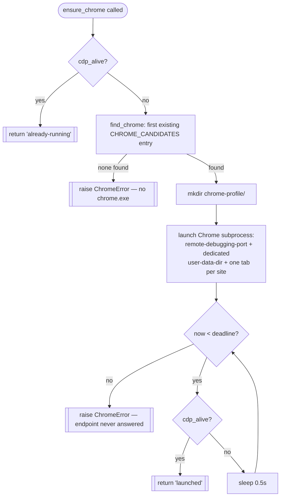

# Chrome Launcher — Flow

**About:** [description](../__about/chrome.md)

## Algorithm

Pseudocode (language-neutral):

    FUNCTION ensure_chrome(site_urls, cdp_url):
        IF cdp_alive(cdp_url):
            RETURN "already-running"

        chrome_exe = first existing path in CHROME_CANDIDATES
        IF none exist:
            RAISE ChromeError("chrome.exe not found — add the path")

        ensure CHROME_PROFILE_DIR exists
        SPAWN chrome_exe with:
            --remote-debugging-port=CDP_PORT
            --user-data-dir=CHROME_PROFILE_DIR
            --no-first-run --no-default-browser-check
            one URL per requested site

        deadline = now + CHROME_LAUNCH_TIMEOUT_S
        WHILE now < deadline:
            IF cdp_alive(cdp_url):
                RETURN "launched"
            SLEEP 0.5s
        RAISE ChromeError("Chrome started but endpoint never answered —
                            check for a stuck profile lock or firewall")
