# CDP Driver — Flow

**About:** [description](../__about/driver.md)

## Algorithm — the F1 turn-based per-item protocol

```mermaid
%%{init: {'flowchart': {'subGraphTitleMargin': {'top': 0, 'bottom': 35}}}}%%
flowchart TB
    subgraph SUBMIT["submit_prompt(prompt) / submit_with_image(image, prompt)"]
        direction TB
        S0[_ensure_ready: wait out a busy
        composer, refresh only if stuck] --> S1[capture_baseline:
        turn_count, last_img_src]
        S1 --> S2{submit_with_image?}
        S2 -- yes --> S3[_attach_image: walk '+' menu,
        set file, wait for preview]
        S2 -- no --> S4
        S3 --> S4[_type_into_box: clear if non-empty,
        insert prompt, VERIFY it landed]
        S4 --> S5[_click_send]
        S5 --> S6{SelectorRot on send button?}
        S6 -- yes, first miss --> S7[reload page, reattach image
        if any, retype, retry ONCE]
        S7 --> S5
        S6 -- no / second miss --> S8[click send]
        S8 --> S9[_confirm_sent: poll for
        composer empty AND our text
        as newest user turn]
        S9 -- not confirmed by halfway --> S10[retry: click+Enter] --> S9
        S9 -- confirmed --> S11[["submitted"]]
        S9 -- timeout --> S12[["raise DriverError — send not confirmed"]]
    end

    subgraph AWAIT["await_done()"]
        direction TB
        A0[poll loop, bounded by
        generation_timeout_s] --> A1{new assistant turn
        beyond baseline?}
        A1 -- no --> A2{busy signal ever appeared?}
        A2 -- no, past busy_appear_timeout_s --> A3[["raise NoImage(had_text=False)"]]
        A2 -- yes, still waiting --> A0
        A1 -- yes --> A4{turn holds a loaded
        image with a NEW src?}
        A4 -- yes --> A5[["done — extract next"]]
        A4 -- no --> A6[scan turn text]
        A6 --> A7{degrade banner up?}
        A7 -- yes --> A8[["raise ModelDegraded"]]
        A7 -- no --> A9{image-failed marker?}
        A9 -- yes --> A10[["raise ImageGenFailed"]]
        A9 -- no --> A11{quota / refusal marker?}
        A11 -- quota --> A12[["raise TerminalState"]]
        A11 -- refusal --> A13[["raise ItemRefused(category)"]]
        A11 -- no match --> A14{text present and
        not busy, settled?}
        A14 -- yes --> A15[["raise NoImage(had_text=True)"]]
        A14 -- no --> A0
    end

    subgraph EXTRACT["extract_image()"]
        direction TB
        X0[locate the new turn's loaded
        image, src != baseline] --> X1[canvas drawImage +
        toDataURL in-page]
        X1 -- CSP blocks fetch of blob --> X1
        X1 -- canvas fails --> X2[fallback: fetch + FileReader]
        X2 --> X3[["return decoded bytes"]]
        X1 --> X3
    end

    SUBMIT --> AWAIT --> EXTRACT
```

Pseudocode (language-neutral):

    FUNCTION submit_prompt(prompt):
        ensure_ready()                     # wait out a genuinely busy composer
        baseline = capture_baseline()      # turn_count, last_img_src
        type_into_box(prompt)              # clear-if-non-empty, insert, VERIFY
        click_send(prompt)                 # ONE reload-recovery retry on SelectorRot
        confirm_sent(prompt)               # poll: composer empty + our text is
                                            # the newest user turn; one mid-window retry

    FUNCTION await_done():
        baseline = the captured Baseline
        WHILE elapsed < generation_timeout_s:
            turn = last assistant turn IF conversation grew past baseline ELSE None
            IF turn has a loaded image with src != baseline.last_img_src:
                RETURN                               # done
            IF turn has text:
                IF degrade_banner up:               RAISE ModelDegraded
                IF text matches image-failed marker: RAISE ImageGenFailed
                IF text matches quota marker:        RAISE TerminalState
                IF text matches refusal marker:      RAISE ItemRefused(category)
                IF text stands alone (not busy) for >= text_settle_s:
                    RAISE NoImage(had_text=True)     # loud skip, never nudge
            ELSE IF nothing new AND busy never appeared past busy_appear_timeout_s:
                RAISE NoImage(had_text=False)        # the one nudge-eligible case
            SLEEP poll_interval
        RAISE GenerationTimeout

    FUNCTION extract_image():
        WHILE elapsed < image_ready_timeout_s:
            img = the new turn's loaded image, src != baseline.last_img_src
            IF img found: BREAK
            check the turn's text for degrade/quota/refusal markers
            SLEEP poll_interval
        TRY canvas drawImage + toDataURL (works even under blob: CSP)
        EXCEPT: fetch(src) + FileReader as fallback
        RETURN decoded bytes
