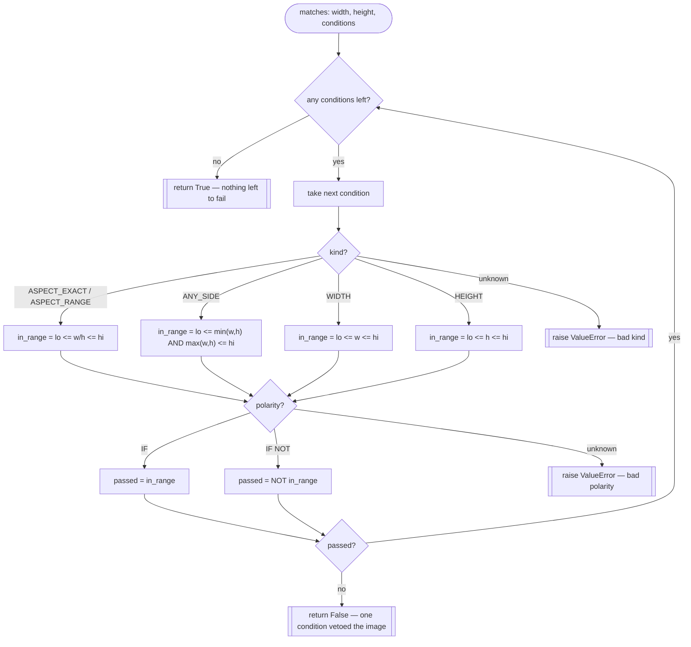

# Shared Filter Framework — Flow

**About:** [description](../__about/filters.md)

## Algorithm

Pseudocode (language-neutral):

    FUNCTION matches(width, height, conditions) -> bool:
        FOR EACH condition IN conditions:
            in_range = MEASURE(condition.kind, width, height)
                          IN [condition.lo, condition.hi]
            IF condition.polarity == "IF":
                passed = in_range
            ELSE IF condition.polarity == "IF NOT":
                passed = NOT in_range
            ELSE:
                RAISE ValueError("unknown polarity")
            IF NOT passed:
                RETURN False        # AND stacking — one failure vetoes all
        RETURN True                 # every condition passed (or none exist)

    FUNCTION MEASURE(kind, width, height):
        IF kind IN (ASPECT_EXACT, ASPECT_RANGE): RETURN width / height
        IF kind == ANY_SIDE:  RETURN (min(width, height), max(width, height))
                               # tested as lo <= min AND max <= hi
        IF kind == WIDTH:     RETURN width
        IF kind == HEIGHT:    RETURN height
        RAISE ValueError("unknown filter kind")
