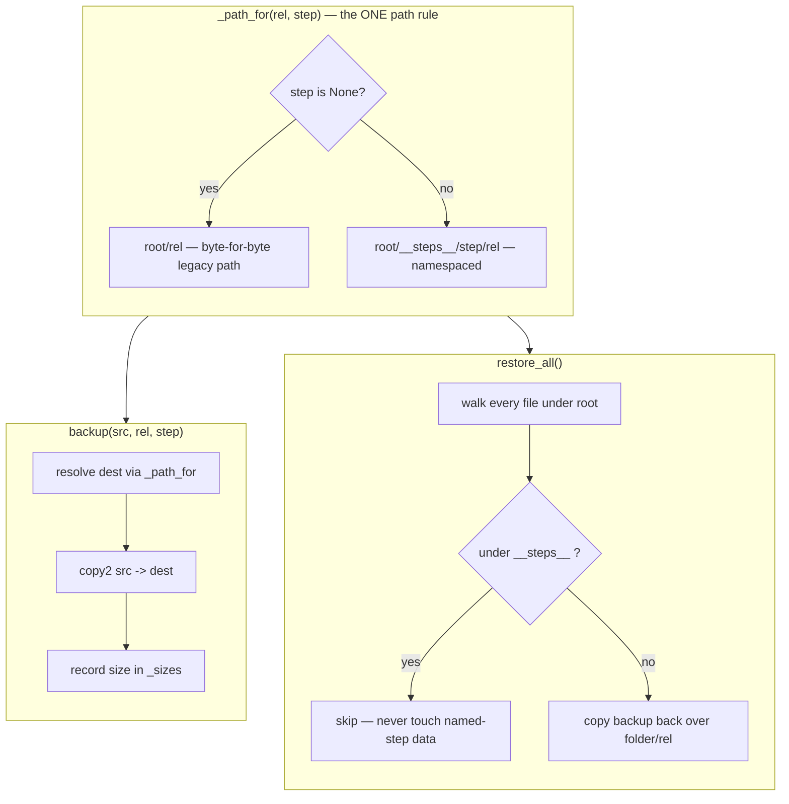

# Job Temp / Restore — Flow

**About:** [description](../__about/jobtemp.md)

## Algorithm

Pseudocode (language-neutral):

    FUNCTION _path_for(rel, step):
        IF step IS None:
            RETURN root / rel                       # unchanged legacy path
        RETURN root / "__steps__" / step / rel       # namespaced, never collides

    FUNCTION backup(src, rel, step=None):
        dest = _path_for(rel, step)
        COPY src -> dest (create parent dirs)
        sizes[(rel, step)] = size_of(dest)
        RETURN dest

    FUNCTION restore_all():
        count = 0
        FOR EACH file UNDER root (recursive):
            IF file's first path segment == "__steps__":
                CONTINUE                              # named-step: out of scope
            rel = file's path relative to root
            IF restore_one(rel):
                count += 1
        RETURN count

    FUNCTION measure(kind, before_path, after_path):
        (bw, bh) = size_of(before_path); (aw, ah) = size_of(after_path)
        IF kind == "bg":
            pct = fraction of pixels whose alpha dropped below
                  JOBTEMP_REMOVED_ALPHA between before and after
        ELSE IF kind == "crop":
            pct = (before_area - after_area) / before_area
        ELSE IF kind == "upscale":
            pct = (after_area - before_area) / before_area
        ELSE IF kind == "aspect":
            pct = growth of whichever axis actually changed (w or h)
        RETURN {before: "bw x bh", after: "aw x ah", pct, label}
