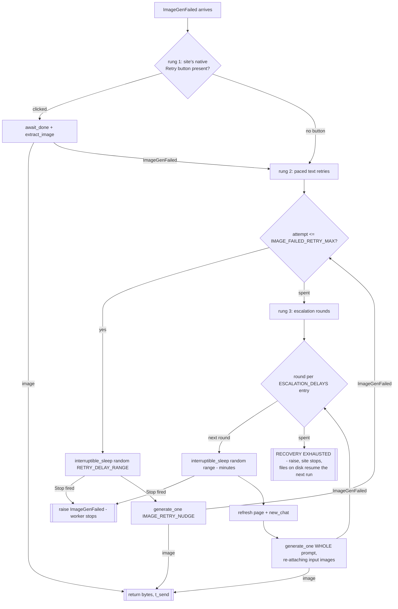

# Recovery — flow

The image-failure recovery ladder (`recover_image_failed`), cheapest
rung first. See [about](../__about/recovery.md) for the responsibility
and the split history.

Notes:

- Only `ImageGenFailed` is caught per rung — a quota (`TerminalState`)
  or refusal (`ItemRefused`) surfacing mid-recovery propagates loudly
  to the runner's own handlers, exactly as on a first attempt.
- `interruptible_sleep` wakes every 0.5 s to honour Stop; True =
  Stop cut the wait — the ladder abandons recovery the same way as
  exhaustion (the raise), never half-continues.
- Rung 3 is the ONLY rung that re-attaches "← ref" input images: the
  earlier rungs stay in the same chat where the image(s) already sit;
  the new session has no history.
