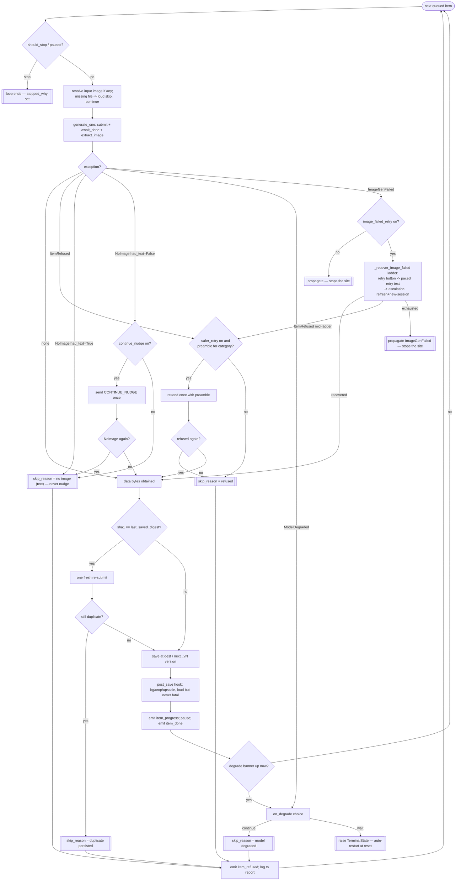

# Run Loop — Flow

**About:** [description](../__about/runner.md)

## Algorithm — per-item handling inside `run_sheet`

Pseudocode (language-neutral):

    FUNCTION run_sheet(sheet, driver, out_base, site_key, ...):
        queue = items not yet on disk (unattended) OR the ticked `only` set
        FOR EACH item IN queue:
            IF should_stop() OR wait_while_paused(...): BREAK

            input_path = resolve item.input_image relative to sheet folder
                         (missing file -> loud skip, CONTINUE)

            TRY:
                (data, t_send) = generate_one(item.prompt + suffix, input_path)
            CATCH ItemRefused AS exc:
                (data, t_send) = try_safer_retry(exc) OR skip_reason = "refused"
            CATCH NoImage AS exc:
                IF exc.had_text: skip_reason = "no image (text)"     # never nudge
                ELSE IF continue_nudge:
                    TRY (data, t_send) = generate_one(CONTINUE_NUDGE)
                    CATCH NoImage: skip_reason = "no image after nudge"
                ELSE: skip_reason = "no image"
            CATCH ModelDegraded AS exc:
                choice = on_degrade(exc.retry_after_s) OR "wait"
                IF choice == "continue": skip_reason = "model degraded"
                ELSE: RAISE TerminalState(exc)                       # auto-restart
            CATCH ImageGenFailed AS exc:
                IF NOT image_failed_retry: RAISE                     # stops the site
                TRY (data, t_send) = recover_image_failed_ladder(exc)
                CATCH ItemRefused nested: same handling as ItemRefused above

            IF skip_reason: report + emit item_refused; pause; CONTINUE

            IF sha1(data) == last_saved_digest:                      # duplicate guard
                TRY (data, t_send) = generate_one(item.prompt + suffix) ONCE more
                IF still duplicate: skip_reason = "duplicate persisted"; CONTINUE

            rel = version_dest[item.drop_path] OR dest_for(item.drop_path, site_key)
            WRITE data TO out_base / rel
            actions = post_save(dest) IF post_save ELSE []            # loud, never fatal
            EMIT item_progress(rel, gen_s, actions)
            pause(timing)                                             # paced, Stop-aware
            EMIT item_done(rel, gen_s, over_s, actions)

            IF degrade_banner_probe() is up AND not degrade_handled:
                same on_degrade choice as ModelDegraded above
