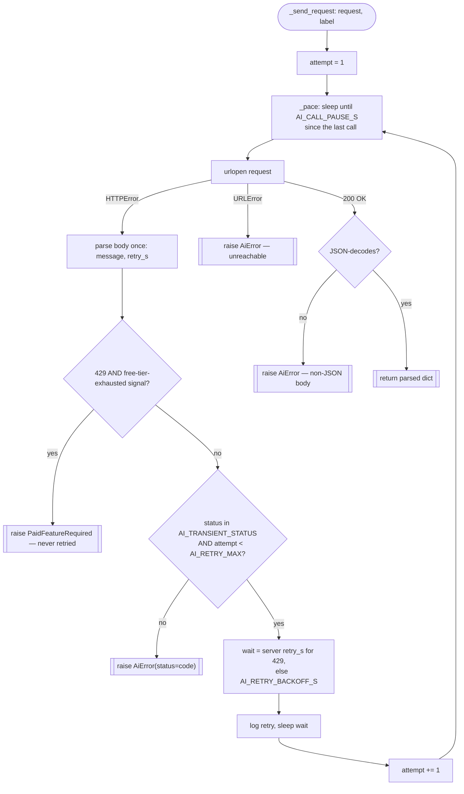

# Gemini REST Client — Flow

**About:** [description](../__about/client.md)

## Algorithm — `_send_request`'s retry/pace/classification shell

Pseudocode (language-neutral):

    FUNCTION _send_request(request, label):
        FOR attempt IN 1..AI_RETRY_MAX:
            pace()                                    # keep calls AI_CALL_PAUSE_S apart
            TRY:
                raw = urlopen(request)
            CATCH HTTPError AS exc:
                (message, retry_s) = parse_http_error_body(exc)   # read body ONCE
                IF exc.code == 429 AND is_paid_quota_error(message):
                    RAISE PaidFeatureRequired(message)            # permanent, first try
                IF exc.code NOT IN TRANSIENT_STATUS OR attempt == AI_RETRY_MAX:
                    RAISE AiError(message, status=exc.code)       # permanent or exhausted
                wait = retry_s (429, capped) ELSE AI_RETRY_BACKOFF_S (503/500)
                LOG retry; SLEEP(wait); CONTINUE
            CATCH URLError AS exc:
                RAISE AiError("unreachable: " + exc.reason)
            RETURN json_decode(raw)                    # loud AiError on malformed JSON
        # unreachable — the final attempt above always raises or returns

    FUNCTION model_for(purpose):
        override = settings.json["models"][purpose]     # per-purpose GUI override
        RETURN override IF non-blank ELSE hardcoded fallback constant for purpose

    FUNCTION recommend_model(models, purpose):
        capable = capable_models(models, purpose)        # name/method filter
        FOR EACH ranked_substring IN MODEL_PURPOSE_RANKING[purpose]:
            FOR EACH model IN capable:
                IF ranked_substring IN model.name: RETURN model.name
        RETURN newest_by_name(capable) IF capable ELSE None
