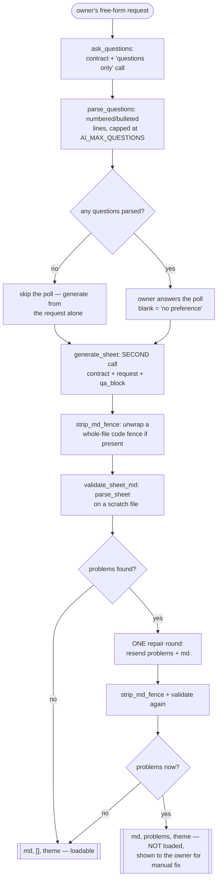

# Sheet-Generator Flow — Flow

**About:** [description](../__about/sheet_flow.md)

## Algorithm

Pseudocode (language-neutral):

    FUNCTION ask_questions(request, contract):
        answer = generate_text(request, system=QUESTIONS_SYSTEM(contract))
        RETURN parse_questions(answer)          # capped at AI_MAX_QUESTIONS

    FUNCTION generate_sheet(request, questions, answers, contract, work_dir):
        qa = qa_block(questions, answers)        # blank answer -> "no preference"
        md = strip_md_fence(generate_text(SHEET_REQUEST(request, qa),
                                           system=SHEET_SYSTEM(contract)))
        (problems, theme) = validate_sheet_md(md, work_dir)   # REAL parser
        IF problems:
            repaired = generate_text(REPAIR_PROMPT(problems, md),
                                      system=SHEET_SYSTEM(contract))
            md = strip_md_fence(repaired)
            (problems, theme) = validate_sheet_md(md, work_dir)   # ONE round only
        RETURN (md, problems, theme)             # problems != [] -> caller must NOT load

    FUNCTION validate_sheet_md(md, work_dir):
        WRITE md TO a scratch file under work_dir
        TRY: sheet = parse_sheet(scratch_file)
        CATCH SheetError: RETURN (["no H1 theme"], None)
        RETURN ([f"L{p.line}: {p.message}" for p in sheet.problems], sheet.theme)
