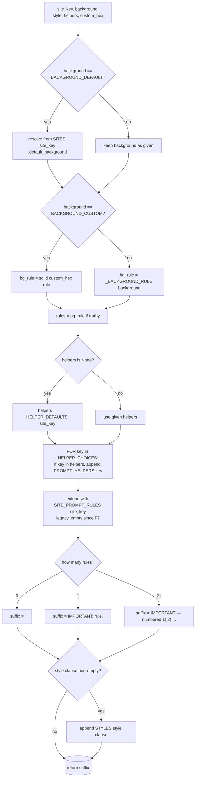
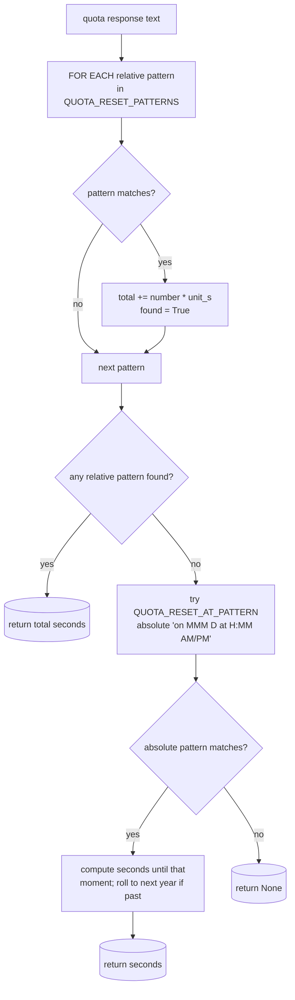

# AI Config — Flow

**About:** [description](../__about/ai.md)

## Structure

```mermaid
%%{init: {'flowchart': {'subGraphTitleMargin': {'top': 0, 'bottom': 35}}}}%%
flowchart TB
    A[ai.py] --> S1[PROMPT SUFFIX — BACKGROUND RULE + PROMPT HELPERS]
    A --> S2[PER-AGENT STYLE CLAUSE]
    A --> S3[PROMPT SUFFIX ASSEMBLY — prompt_suffix]
    A --> S4[SAFER-RETRY PREAMBLES + CONTINUE NUDGE]
    A --> S5[IMAGE-GENERATION-FAILED RETRY LADDER]
    A --> S6[GEMINI API — MODEL NAMES + ENDPOINT]
    A --> S7[MODEL DISCOVERY + CALL / RETRY TUNABLES]
    A --> S8[API IMAGE QUOTA MARKERS]
    A --> S9[API IMAGE GENERATION JOB]
    A --> S10[AI SHEET GENERATOR — PROMPTS]
    A --> S11[IMAGE CHECKER — COPY]
    A --> S12[FIXER AI — TEMPLATES + MODE]
    A --> S13[MODEL DEGRADATION]
    A --> S14[QUOTA RESET TIME — PARSER]
```

## Algorithm — `prompt_suffix`

Pseudocode:

    FUNCTION prompt_suffix(site_key, background, style, helpers, custom_hex):
        rules = []
        IF background == BACKGROUND_DEFAULT:
            background = SITES[site_key].default_background OR "white"
        IF background == BACKGROUND_CUSTOM:
            bg_rule = "solid " + (custom_hex OR "#ffffff") + " background rule"
        ELSE:
            bg_rule = _BACKGROUND_RULE[background]     # None for "none"
        IF bg_rule: rules.append(bg_rule)

        helpers = helpers OR HELPER_DEFAULTS[site_key]
        FOR key IN HELPER_CHOICES:                      # stable order
            IF key IN helpers: rules.append(PROMPT_HELPERS[key])
        rules += SITE_PROMPT_RULES[site_key]             # legacy, empty

        IF rules is empty: suffix = ""
        ELIF len(rules) == 1: suffix = "IMPORTANT: {rule}."
        ELSE: suffix = "IMPORTANT — numbered list of all rules"

        clause = STYLES.get(style)                       # "None" -> ""
        IF clause: suffix += clause (own paragraph if suffix was empty)
        RETURN suffix

The result is a CONSTANT per (site, background, style, helpers) — no
prompt-text inference happens here (the aspect-ratio inference law was
removed 2026-07-22; the sheet author states it explicitly).

## Algorithm — `parse_quota_reset`

Relative phrasings ("in 27 minutes", Serbian "za 14 sati") are tried
first and SUMMED (so an hours phrase and a minutes phrase in the same
text both count); only when NONE match does the absolute-moment
fallback run. A message with neither form (e.g. Gemini's "as soon as
your limit resets") returns `None` — the caller still stops, the reset
time is a bonus, never a requirement.
