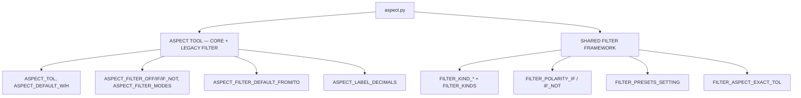

# Aspect Config — Flow

**About:** [description](../__about/aspect.md)

## Structure

The shared filter framework (C) is a LATER phase meant to eventually
replace the legacy scalar filter (B2/B3) — nothing here is wired into
a tool yet beyond the engine constants; migrating existing tools onto
it is tracked separately (see [Config (folder)](../___config.md)'s
Design Decisions).
