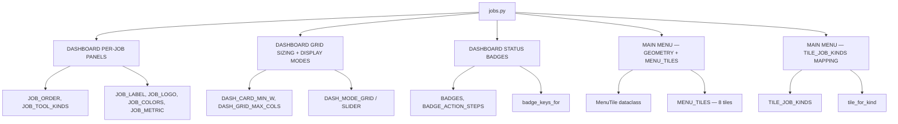
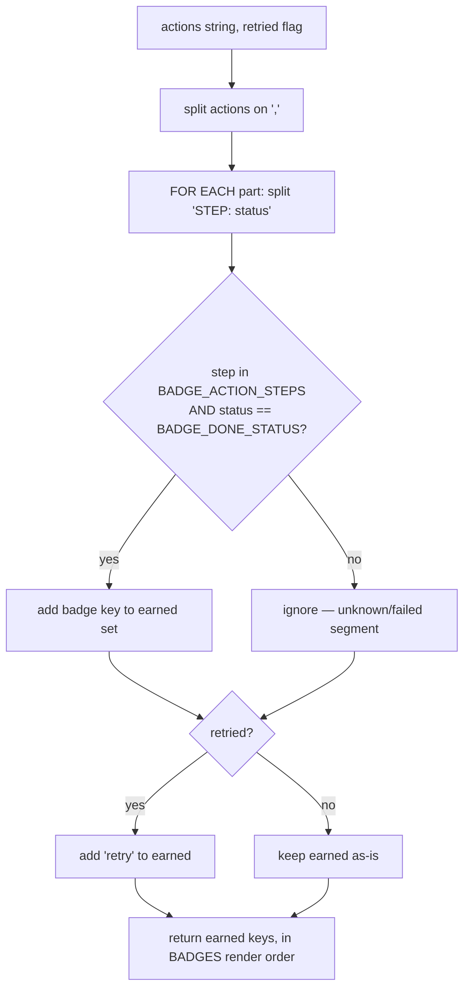

# Jobs Config — Flow

**About:** [description](../__about/jobs.md)

## Structure

## Algorithm — `badge_keys_for`

Pseudocode:

    FUNCTION badge_keys_for(actions, retried=False):
        earned = {}
        FOR EACH part IN actions.split(","):
            step, status = part.partition(":")
            key = BADGE_ACTION_STEPS.get(step.strip())
            IF key is not None AND status.strip() == BADGE_DONE_STATUS:
                earned.add(key)
        IF retried: earned.add("retry")
        RETURN tuple(key for key in BADGES if key in earned)  # render order
