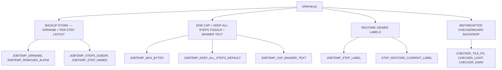

# Job Temp Config — Flow

**About:** [description](../__about/jobtemp.md)

## Structure

## The step ordering contract

`JOBTEMP_STEP_NAMES` fixes the canonical order regardless of the
order individual `backup()` calls actually happen in:

    ("original", "bg", "crop", "aspect", "upscale", "fixer")

`JobTemp.steps_for(rel)` (in `painter/jobtemp.py`) filters this tuple
down to whichever steps actually backed up one `rel` — its result is
ALWAYS in this order.
