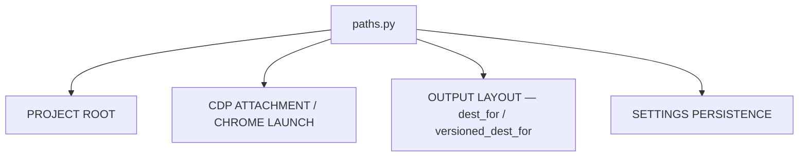
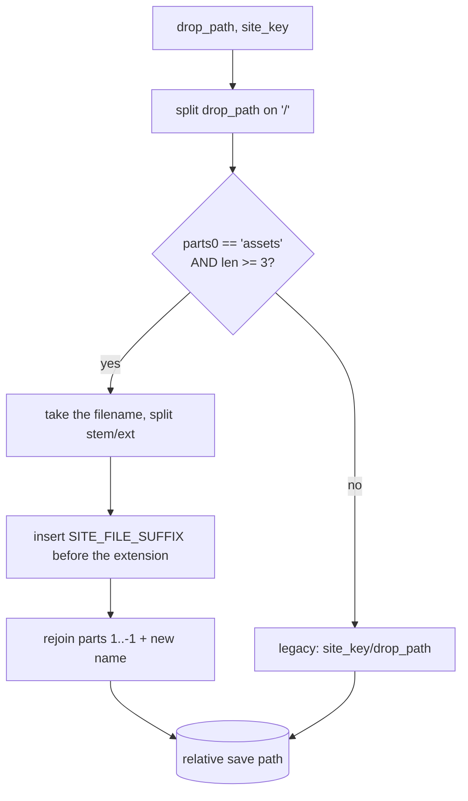
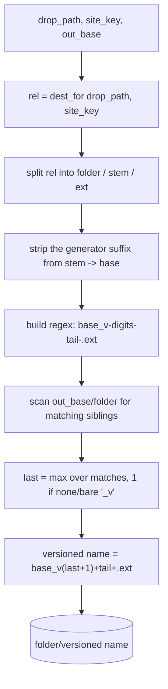

# Paths — Flow

**About:** [description](../__about/paths.md)

## Structure

## Algorithm — `dest_for`

Pseudocode:

    FUNCTION dest_for(drop_path, site_key):
        parts = drop_path.split("/")
        suffix = SITE_FILE_SUFFIX[site_key]      # KeyError if unregistered
        IF parts[0] == "assets" AND len(parts) >= 3:
            name = parts[-1]
            stem, ext = split on last "."
            name = f"{stem}{suffix}.{ext}"        # suffix ALWAYS terminal
            RETURN "/".join(parts[1:-1] + [name])
        RETURN "/".join([site_key, drop_path])    # legacy non-assets drop

## Algorithm — `versioned_dest_for`

Pseudocode (language-neutral — the owner's rotation rule):

    FUNCTION versioned_dest_for(drop_path, site_key, out_base):
        rel = dest_for(drop_path, site_key)
        folder, name = split rel on last "/"
        stem, ext = split name on last "."          # legacy: no ext
        suffix = SITE_FILE_SUFFIX[site_key]
        tail = suffix IF stem ends with suffix ELSE ""
        base = stem WITHOUT the trailing tail

        pattern = base + "_v" + (digits, optional) + tail + ("." + ext)?

        last = 1                                     # canonical file = v1
        FOR EACH file IN (out_base / folder):
            IF file matches pattern:
                last = MAX(last, digits OR 1)         # bare "_v" counts as 1
        RETURN folder / (base + "_v" + (last + 1) + tail + "." + ext)

Gaps in the existing `_vN` siblings never matter — only the highest
found number decides the next one. The owner's irregular `_v`/`_v1`
forms both parse as version 1, matching DOMY's own rotation
convention.
