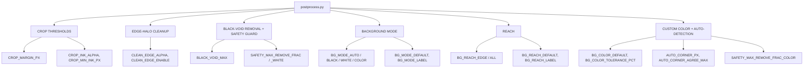

# Postprocess Config — Flow

**About:** [description](../__about/postprocess.md)

## Structure

## The three mechanisms are ONE (root Rule #19)

`bg_remove.remove_color_background` keys on per-channel distance from
a target colour; black (`#000000`) and white (`#FFFFFF`) are just two
targets sharing the same engine as a custom colour — the rule is
defined once (BG_MODE block), never enumerated per colour.
