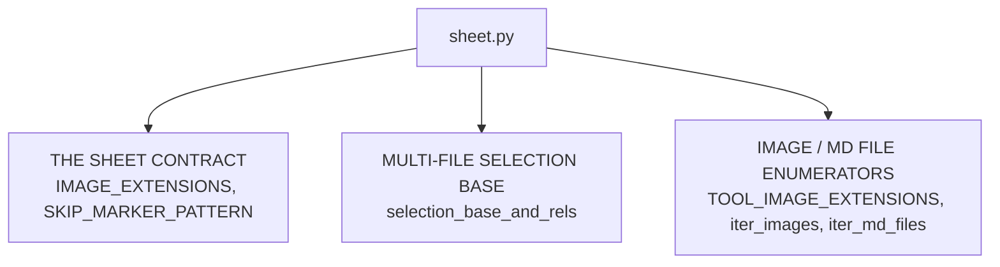
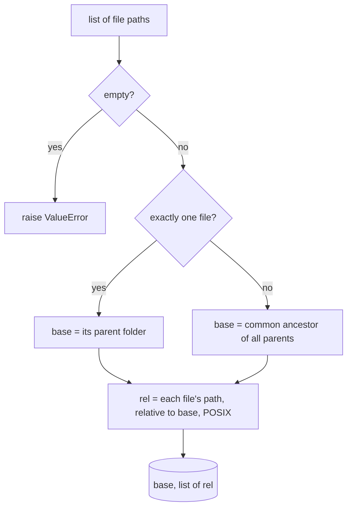

# Sheet — Flow

**About:** [description](../__about/sheet.md)

## Structure

## Algorithm — `selection_base_and_rels`

Pseudocode:

    FUNCTION selection_base_and_rels(paths):
        files = [Path(p) for p in paths]
        IF files is empty: raise ValueError
        IF len(files) == 1:
            base = files[0].parent
        ELSE:
            base = common_path(f.parent for f in files)
        rels = [f.relative_to(base).as_posix() for f in files]
        RETURN base, rels

`iter_images`/`iter_md_files` are a single `rglob` walk each, sorted —
no branching worth a diagram beyond "recursive glob, filter by
extension, sort".
