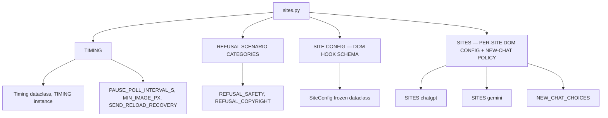

# Sites Config — Flow

**About:** [description](../__about/sites.md)

## Structure

## `SiteConfig` field groups (nested view)

- identity: `name`, `url`, `url_fragment`, `default_background`
- composer: `prompt_box`, `send_button`, `busy_signal`
- result: `response_container`, `result_image`, `user_turn`
- failure signals: `refusal_markers` (by scenario),
  `quota_text_markers`, `degrade_banner`, `image_failed_text_markers`,
  `image_error_retry_button`
- navigation: `new_chat`
- image attach: `attach_menu_path`, `file_input`, `attach_preview`

Every tuple field is a fallback LIST tried in order — the driver never
guesses when none match (root Rule #1).
