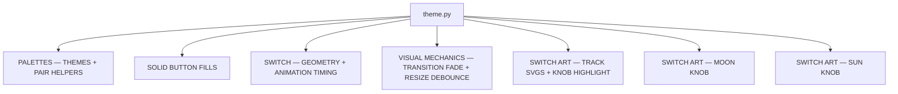

# Theme Config — Flow

**About:** [description](../__about/theme.md)

## Structure

Nested view of the two biggest sections:

- PALETTES
  - `THEMES["night"]` — darkly, verbatim
  - `THEMES["day"]` — `painter_day`, the custom light theme
  - `theme_pair` / `status_pair` — day/night lookup helpers
- SWITCH ART — MOON KNOB
  - radial gradient (center → edge)
  - 7 craters (diameter, x, y) with lit rims
  - terminator shading (light direction, dark floor, soft band)
  - deterministic surface noise (fixed seed)
- SWITCH ART — SUN KNOB
  - radial gradient (center → edge)
  - blurred glow disc behind the knob
